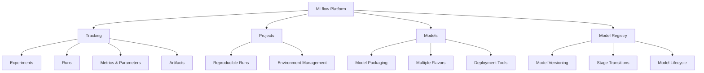

# 01 - MLflow Fundamentals

## Overview
MLflow is an open-source platform for managing the end-to-end machine learning lifecycle. It provides four main components: Tracking, Projects, Models, and Model Registry.

## Core Components



## Installation

```bash
# Basic installation
pip install mlflow

# With additional dependencies
pip install mlflow[extras]

# Specific version
pip install mlflow==2.10.0
```

## First MLflow Tracking Example

```python
import mlflow
import mlflow.sklearn
from sklearn.linear_model import LogisticRegression
from sklearn.datasets import load_iris
from sklearn.model_selection import train_test_split
from sklearn.metrics import accuracy_score

# Load data
iris = load_iris()
X_train, X_test, y_train, y_test = train_test_split(
    iris.data, iris.target, test_size=0.2, random_state=42
)

# Start MLflow run
with mlflow.start_run():
    # Log parameters
    mlflow.log_param("model_type", "LogisticRegression")
    mlflow.log_param("max_iter", 200)
    
    # Train model
    model = LogisticRegression(max_iter=200)
    model.fit(X_train, y_train)
    
    # Make predictions and log metrics
    predictions = model.predict(X_test)
    accuracy = accuracy_score(y_test, predictions)
    mlflow.log_metric("accuracy", accuracy)
    
    # Log the model
    mlflow.sklearn.log_model(model, "model")
    
    print(f"Model accuracy: {accuracy}")
```

## MLflow UI

```bash
# Start the MLflow UI (default port 5000)
mlflow ui

# Custom port and host
mlflow ui --host 0.0.0.0 --port 8080

# With backend store
mlflow ui --backend-store-uri sqlite:///mlflow.db
```

## Key Concepts

### 1. Experiments
- Organize related runs
- Named collections of runs
- Can have tags and metadata

### 2. Runs
- Individual execution of ML code
- Contains parameters, metrics, artifacts, and metadata
- Nested runs supported for complex workflows

### 3. Parameters
- Input values to your model (hyperparameters)
- Immutable key-value pairs
- Examples: learning_rate, batch_size, epochs

### 4. Metrics
- Numeric values that can be updated throughout a run
- Examples: accuracy, loss, F1-score
- Can log multiple values over time (for plotting)

### 5. Artifacts
- Output files from your runs
- Examples: models, plots, data files
- Stored in artifact repository

## Directory Structure

```
mlruns/
├── 0/                          # Default experiment
│   ├── meta.yaml
│   └── <run_id>/
│       ├── meta.yaml           # Run metadata
│       ├── metrics/            # Metric files
│       ├── params/             # Parameter files
│       ├── tags/               # Tag files
│       └── artifacts/          # Artifacts directory
└── 1/                          # Custom experiment
    └── ...
```

## Environment Variables

```bash
# Set tracking URI
export MLFLOW_TRACKING_URI=http://localhost:5000

# Set artifact location
export MLFLOW_ARTIFACT_ROOT=s3://my-bucket/mlflow-artifacts

# Set experiment name
export MLFLOW_EXPERIMENT_NAME=my-experiment
```

## Best Practices

1. **Organize Experiments**: Use meaningful experiment names
2. **Tag Runs**: Add tags for easy filtering and searching
3. **Log Everything**: Parameters, metrics, artifacts, and code
4. **Use Context Manager**: Always use `with mlflow.start_run():`
5. **Set Run Names**: Use descriptive run names for easy identification

## Common Patterns

```python
# Set experiment
mlflow.set_experiment("my-experiment")

# Set run name
with mlflow.start_run(run_name="lr-model-v1"):
    pass

# Add tags
with mlflow.start_run():
    mlflow.set_tag("team", "data-science")
    mlflow.set_tag("model_type", "classification")

# Log multiple metrics at once
with mlflow.start_run():
    mlflow.log_metrics({
        "accuracy": 0.95,
        "precision": 0.93,
        "recall": 0.94
    })

# Log artifacts
with mlflow.start_run():
    # Save a plot
    import matplotlib.pyplot as plt
    plt.plot([1, 2, 3], [4, 5, 6])
    plt.savefig("plot.png")
    mlflow.log_artifact("plot.png")
```

## Next Steps
- Explore different model flavors (sklearn, pytorch, tensorflow)
- Learn about model registry
- Understand MLflow Projects for reproducibility
- Set up remote tracking servers

---
**Navigation**: Next → [02-mlflow-tracking-advanced.md](02-mlflow-tracking-advanced.md)
