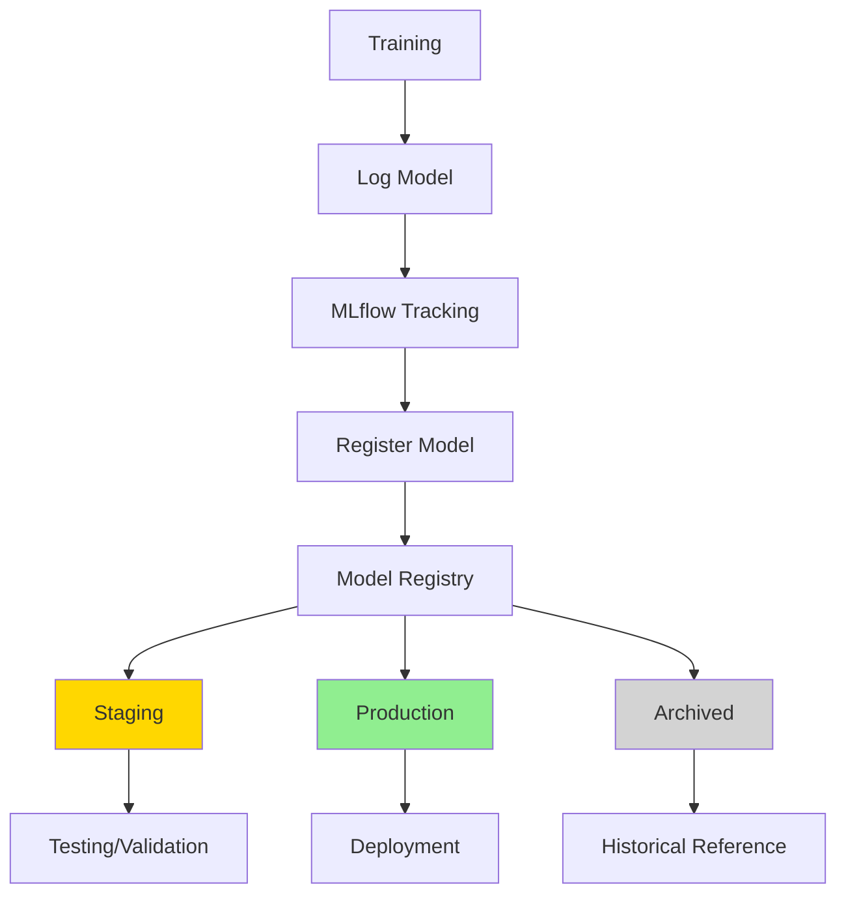
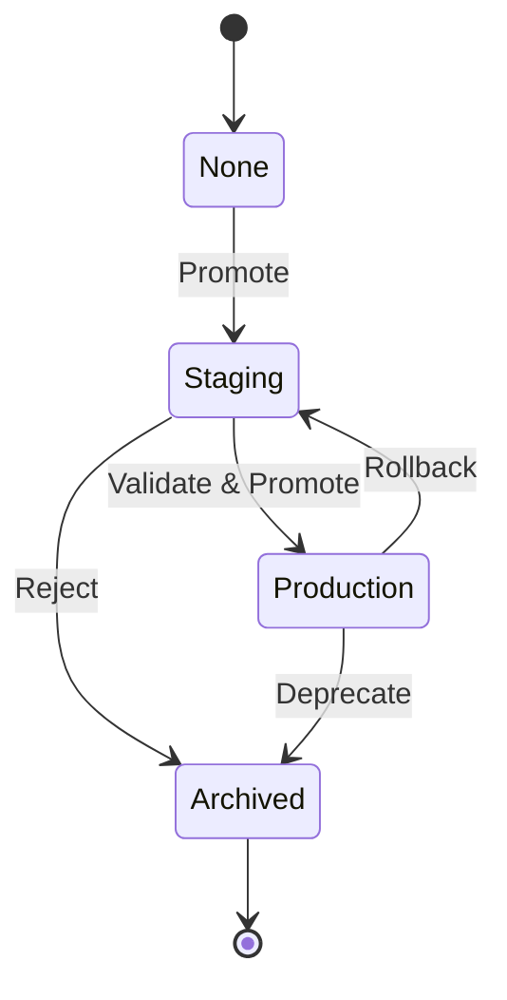

# 03 - MLflow Models & Model Registry

## Overview
MLflow Model Registry provides centralized model management, versioning, and lifecycle stages. It's essential for production ML workflows.

## Model Registry Architecture



## Model Stages Lifecycle



## Registering Models

### Method 1: Register During Training
```python
import mlflow
import mlflow.sklearn
from sklearn.ensemble import RandomForestClassifier

mlflow.set_tracking_uri("http://mlflow-server:5000")

with mlflow.start_run():
    model = RandomForestClassifier(n_estimators=100)
    model.fit(X_train, y_train)
    
    # Log and register in one step
    mlflow.sklearn.log_model(
        sk_model=model,
        artifact_path="model",
        registered_model_name="iris-classifier"
    )
```

### Method 2: Register Existing Run
```python
from mlflow.tracking import MlflowClient

client = MlflowClient()

# Find the best run
experiment = client.get_experiment_by_name("iris-experiment")
runs = client.search_runs(
    experiment.experiment_id,
    order_by=["metrics.accuracy DESC"],
    max_results=1
)

best_run = runs[0]

# Register the model from that run
model_uri = f"runs:/{best_run.info.run_id}/model"
result = mlflow.register_model(
    model_uri=model_uri,
    name="iris-classifier"
)

print(f"Model version: {result.version}")
```

### Method 3: Register with Version Description
```python
from mlflow.tracking import MlflowClient

client = MlflowClient()

# Create registered model if it doesn't exist
try:
    client.create_registered_model(
        name="iris-classifier",
        tags={"task": "classification"},
        description="Iris species classifier using Random Forest"
    )
except:
    pass  # Model already exists

# Register specific version
model_uri = f"runs:/{run_id}/model"
mv = client.create_model_version(
    name="iris-classifier",
    source=model_uri,
    run_id=run_id,
    description="Improved accuracy with feature engineering"
)
```

## Managing Model Versions

### List All Versions
```python
from mlflow.tracking import MlflowClient

client = MlflowClient()

# Get all versions
versions = client.search_model_versions("name='iris-classifier'")

for version in versions:
    print(f"Version: {version.version}")
    print(f"Stage: {version.current_stage}")
    print(f"Run ID: {version.run_id}")
    print("---")
```

### Transition Stages
```python
from mlflow.tracking import MlflowClient

client = MlflowClient()

# Promote to Staging
client.transition_model_version_stage(
    name="iris-classifier",
    version=3,
    stage="Staging"
)

# Promote to Production
client.transition_model_version_stage(
    name="iris-classifier",
    version=3,
    stage="Production",
    archive_existing_versions=True  # Archive current production versions
)

# Archive old version
client.transition_model_version_stage(
    name="iris-classifier",
    version=1,
    stage="Archived"
)
```

### Update Version Metadata
```python
client = MlflowClient()

# Update description
client.update_model_version(
    name="iris-classifier",
    version=3,
    description="Best model so far - 95% accuracy with balanced dataset"
)

# Add tags
client.set_model_version_tag(
    name="iris-classifier",
    version=3,
    key="validated",
    value="true"
)

client.set_model_version_tag(
    name="iris-classifier",
    version=3,
    key="validation_date",
    value="2026-02-23"
)
```

## Loading Models from Registry

### Load Latest Version by Stage
```python
import mlflow.pyfunc

# Load production model
model = mlflow.pyfunc.load_model(
    model_uri="models:/iris-classifier/Production"
)

predictions = model.predict(X_test)

# Load staging model
staging_model = mlflow.pyfunc.load_model(
    model_uri="models:/iris-classifier/Staging"
)
```

### Load Specific Version
```python
import mlflow.sklearn

# Load version 3
model = mlflow.sklearn.load_model(
    model_uri="models:/iris-classifier/3"
)

predictions = model.predict(X_test)
```

### Load with Specific Flavor
```python
# Load as sklearn model
import mlflow.sklearn
sklearn_model = mlflow.sklearn.load_model("models:/iris-classifier/Production")

# Load as pyfunc (generic)
import mlflow.pyfunc
pyfunc_model = mlflow.pyfunc.load_model("models:/iris-classifier/Production")

# Load as spark model
import mlflow.spark
spark_model = mlflow.spark.load_model("models:/iris-classifier/Production")
```

## Model Registry UI Operations

Access via MLflow UI at `http://mlflow-server:5000`:
- View all registered models
- Compare versions
- View model lineage
- Transition stages
- Add descriptions and tags

## Model Aliasing (MLflow 2.0+)

Aliases provide flexible references to model versions.

```python
from mlflow.tracking import MlflowClient

client = MlflowClient()

# Set alias
client.set_registered_model_alias(
    name="iris-classifier",
    alias="champion",
    version=5
)

client.set_registered_model_alias(
    name="iris-classifier",
    alias="challenger",
    version=6
)

# Load by alias
champion_model = mlflow.pyfunc.load_model(
    "models:/iris-classifier@champion"
)

challenger_model = mlflow.pyfunc.load_model(
    "models:/iris-classifier@challenger"
)

# Delete alias
client.delete_registered_model_alias(
    name="iris-classifier",
    alias="challenger"
)
```

## Model Approval Workflow

```python
from mlflow.tracking import MlflowClient
import mlflow.pyfunc

client = MlflowClient()

def validate_model(model_name, version):
    """Validate model before promoting to production"""
    
    # Load model
    model_uri = f"models:/{model_name}/{version}"
    model = mlflow.pyfunc.load_model(model_uri)
    
    # Run validation tests
    predictions = model.predict(X_test)
    accuracy = calculate_accuracy(predictions, y_test)
    
    # Set validation metrics as tags
    client.set_model_version_tag(
        name=model_name,
        version=version,
        key="validation_accuracy",
        value=str(accuracy)
    )
    
    # Approve if meets threshold
    if accuracy > 0.90:
        client.transition_model_version_stage(
            name=model_name,
            version=version,
            stage="Production",
            archive_existing_versions=True
        )
        print(f"✓ Model v{version} promoted to Production")
        return True
    else:
        print(f"✗ Model v{version} rejected - accuracy {accuracy} < 0.90")
        return False

# Use in workflow
validate_model("iris-classifier", 3)
```

## Model Lineage and Metadata

```python
from mlflow.tracking import MlflowClient
import pandas as pd

client = MlflowClient()

def get_model_lineage(model_name, version):
    """Get complete lineage for a model version"""
    
    # Get model version details
    mv = client.get_model_version(model_name, version)
    
    # Get run that created this version
    run = client.get_run(mv.run_id)
    
    # Get experiment
    experiment = client.get_experiment(run.info.experiment_id)
    
    lineage = {
        "model_name": model_name,
        "version": version,
        "stage": mv.current_stage,
        "run_id": mv.run_id,
        "experiment_name": experiment.name,
        "created_at": mv.creation_timestamp,
        "parameters": run.data.params,
        "metrics": run.data.metrics,
        "tags": mv.tags
    }
    
    return lineage

# Get lineage
lineage = get_model_lineage("iris-classifier", 3)
print(pd.Series(lineage))
```

## Webhooks and Notifications

Set up webhooks to trigger actions on model registry events.

```python
from mlflow.tracking import MlflowClient

client = MlflowClient()

# Create webhook for stage transitions
client.create_registered_model_webhook(
    name="iris-classifier",
    events=["MODEL_VERSION_TRANSITIONED_STAGE"],
    http_url_spec={
        "url": "https://your-webhook-endpoint.com/notify",
        "authorization": "Bearer your-token"
    }
)

# Webhook receives payload like:
# {
#   "event": "MODEL_VERSION_TRANSITIONED_STAGE",
#   "model_name": "iris-classifier",
#   "version": "3",
#   "from_stage": "Staging",
#   "to_stage": "Production",
#   "timestamp": "2026-02-23T10:30:00Z"
# }
```

## Model Registry Best Practices

### 1. Naming Conventions
```python
# Good naming patterns
model_name = f"{use_case}-{algorithm}-{target}"
# Examples:
# - "fraud-detection-xgboost-binary"
# - "churn-prediction-lstm-multiclass"
# - "recommendation-collaborative-filtering-ranking"
```

### 2. Version Descriptions
```python
# Always add meaningful descriptions
description = f"""
Model Type: {model_type}
Training Date: {training_date}
Dataset: {dataset_name} ({dataset_size} samples)
Key Changes: {changes}
Validation Metrics: accuracy={accuracy}, f1={f1_score}
"""

client.update_model_version(
    name=model_name,
    version=version,
    description=description
)
```

### 3. Tagging Strategy
```python
# Comprehensive tagging
tags = {
    "team": "ml-team",
    "environment": "production",
    "validated": "true",
    "validation_date": "2026-02-23",
    "git_commit": "abc123def",
    "dataset_version": "v2.1",
    "framework": "scikit-learn",
    "framework_version": "1.3.0"
}

for key, value in tags.items():
    client.set_model_version_tag(model_name, version, key, value)
```

### 4. Automated Testing
```python
def automated_model_validation(model_name, version):
    """Run comprehensive validation suite"""
    
    model = mlflow.pyfunc.load_model(f"models:/{model_name}/{version}")
    
    tests = {
        "accuracy_test": test_accuracy(model),
        "inference_time_test": test_inference_time(model),
        "data_drift_test": test_data_drift(model),
        "fairness_test": test_fairness(model),
        "robustness_test": test_robustness(model)
    }
    
    # Log test results as tags
    for test_name, passed in tests.items():
        client.set_model_version_tag(
            model_name, version, test_name, str(passed)
        )
    
    return all(tests.values())
```

---
**Navigation**: [← Previous](02-mlflow-tracking-advanced.md) | Next → [04-mlflow-deployment.md](04-mlflow-deployment.md)
