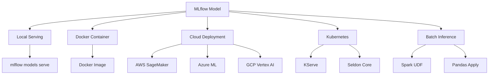

# 04 - MLflow Deployment Patterns

## Overview
MLflow provides multiple deployment options: local serving, Docker containers, cloud platforms, and Kubernetes. This guide covers practical deployment patterns.

## Deployment Options



## Local Serving

### Basic Serving
```bash
# Serve from run
mlflow models serve \
    -m runs:/<run_id>/model \
    -p 5001 \
    --no-conda

# Serve from registry
mlflow models serve \
    -m models:/iris-classifier/Production \
    -p 5001

# With custom host and workers
mlflow models serve \
    -m models:/iris-classifier/Production \
    -h 0.0.0.0 \
    -p 5001 \
    --workers 4
```

### Test Local Endpoint
```bash
# Using curl
curl -X POST http://localhost:5001/invocations \
    -H 'Content-Type: application/json' \
    -d '{
        "dataframe_split": {
            "columns": ["feature1", "feature2", "feature3"],
            "data": [[1.0, 2.0, 3.0], [4.0, 5.0, 6.0]]
        }
    }'

# Using Python
import requests
import json

data = {
    "dataframe_split": {
        "columns": ["sepal_length", "sepal_width", "petal_length", "petal_width"],
        "data": [[5.1, 3.5, 1.4, 0.2]]
    }
}

response = requests.post(
    "http://localhost:5001/invocations",
    json=data,
    headers={"Content-Type": "application/json"}
)

print(response.json())
```

## Docker Deployment

### Build Docker Image
```bash
# Build image from model
mlflow models build-docker \
    -m models:/iris-classifier/Production \
    -n iris-classifier:v1

# Build with custom base image
mlflow models build-docker \
    -m models:/iris-classifier/Production \
    -n iris-classifier:v1 \
    --base-image python:3.10-slim
```

### Run Docker Container
```bash
# Run container
docker run -p 5001:8080 iris-classifier:v1

# Run with environment variables
docker run -p 5001:8080 \
    -e GUNICORN_CMD_ARGS="--timeout 60 --workers 4" \
    iris-classifier:v1

# Run with GPU support
docker run --gpus all -p 5001:8080 iris-classifier:v1
```

### Custom Dockerfile
```dockerfile
# Custom MLflow model serving Dockerfile
FROM python:3.10-slim

# Install MLflow and dependencies
RUN pip install mlflow boto3 psycopg2-binary

# Set environment variables
ENV MLFLOW_TRACKING_URI=http://mlflow-server:5000
ENV MODEL_URI=models:/iris-classifier/Production

# Download model at build time
RUN python -c "import mlflow.pyfunc; mlflow.set_tracking_uri('${MLFLOW_TRACKING_URI}'); mlflow.pyfunc.load_model('${MODEL_URI}')"

# Serve model
CMD mlflow models serve \
    -m ${MODEL_URI} \
    -h 0.0.0.0 \
    -p 8080 \
    --workers 4
```

## Kubernetes Deployment

### Basic K8s Deployment
```yaml
# mlflow-model-deployment.yaml
apiVersion: apps/v1
kind: Deployment
metadata:
  name: iris-classifier
  labels:
    app: iris-classifier
spec:
  replicas: 3
  selector:
    matchLabels:
      app: iris-classifier
  template:
    metadata:
      labels:
        app: iris-classifier
    spec:
      containers:
      - name: model-server
        image: iris-classifier:v1
        ports:
        - containerPort: 8080
        env:
        - name: MLFLOW_TRACKING_URI
          value: "http://mlflow-server:5000"
        - name: GUNICORN_CMD_ARGS
          value: "--timeout 60 --workers 4"
        resources:
          requests:
            memory: "512Mi"
            cpu: "500m"
          limits:
            memory: "2Gi"
            cpu: "2000m"
        livenessProbe:
          httpGet:
            path: /health
            port: 8080
          initialDelaySeconds: 30
          periodSeconds: 10
        readinessProbe:
          httpGet:
            path: /health
            port: 8080
          initialDelaySeconds: 5
          periodSeconds: 5
---
apiVersion: v1
kind: Service
metadata:
  name: iris-classifier-service
spec:
  selector:
    app: iris-classifier
  ports:
  - protocol: TCP
    port: 80
    targetPort: 8080
  type: LoadBalancer
```

### Deploy to Kubernetes
```bash
# Build and push image
docker build -t your-registry/iris-classifier:v1 .
docker push your-registry/iris-classifier:v1

# Apply deployment
kubectl apply -f mlflow-model-deployment.yaml

# Check status
kubectl get pods -l app=iris-classifier
kubectl get svc iris-classifier-service

# Test endpoint
EXTERNAL_IP=$(kubectl get svc iris-classifier-service -o jsonpath='{.status.loadBalancer.ingress[0].ip}')
curl -X POST http://$EXTERNAL_IP/invocations \
    -H 'Content-Type: application/json' \
    -d '{"dataframe_split": {"columns": ["f1", "f2"], "data": [[1.0, 2.0]]}}'
```

### Horizontal Pod Autoscaling
```yaml
# hpa.yaml
apiVersion: autoscaling/v2
kind: HorizontalPodAutoscaler
metadata:
  name: iris-classifier-hpa
spec:
  scaleTargetRef:
    apiVersion: apps/v1
    kind: Deployment
    name: iris-classifier
  minReplicas: 2
  maxReplicas: 10
  metrics:
  - type: Resource
    resource:
      name: cpu
      target:
        type: Utilization
        averageUtilization: 70
  - type: Resource
    resource:
      name: memory
      target:
        type: Utilization
        averageUtilization: 80
```

## Batch Inference

### Pandas UDF (Single Machine)
```python
import mlflow.pyfunc
import pandas as pd

# Load model
model = mlflow.pyfunc.load_model("models:/iris-classifier/Production")

# Batch inference on DataFrame
input_data = pd.read_csv("data_to_score.csv")

# Process in chunks for large datasets
chunk_size = 10000
predictions = []

for chunk in pd.read_csv("data_to_score.csv", chunksize=chunk_size):
    pred = model.predict(chunk)
    predictions.append(pred)

all_predictions = pd.concat(predictions)
```

### Spark UDF (Distributed)
```python
import mlflow.pyfunc
from pyspark.sql import SparkSession
from pyspark.sql.functions import struct, col

# Create Spark session
spark = SparkSession.builder \
    .appName("MLflow Batch Inference") \
    .getOrCreate()

# Load data
df = spark.read.parquet("s3://bucket/data")

# Create UDF from MLflow model
model_uri = "models:/iris-classifier/Production"
predict_udf = mlflow.pyfunc.spark_udf(
    spark, 
    model_uri=model_uri,
    result_type="string"
)

# Apply predictions
feature_cols = ["sepal_length", "sepal_width", "petal_length", "petal_width"]
predictions_df = df.withColumn(
    "prediction",
    predict_udf(struct(*[col(c) for c in feature_cols]))
)

# Save results
predictions_df.write.parquet("s3://bucket/predictions")
```

### Batch with Ray
```python
import ray
import mlflow.pyfunc
import pandas as pd

ray.init()

@ray.remote
def predict_batch(model_uri, data_batch):
    model = mlflow.pyfunc.load_model(model_uri)
    return model.predict(data_batch)

# Distribute inference
model_uri = "models:/iris-classifier/Production"
data = pd.read_csv("data.csv")

# Split into batches
batch_size = 1000
batches = [data[i:i+batch_size] for i in range(0, len(data), batch_size)]

# Parallel inference
futures = [predict_batch.remote(model_uri, batch) for batch in batches]
results = ray.get(futures)

# Combine results
predictions = pd.concat(results)
```

## Cloud Platform Deployments

### AWS SageMaker
```python
import mlflow.sagemaker

# Deploy to SageMaker
mlflow.sagemaker.deploy(
    mode="create",
    app_name="iris-classifier",
    model_uri="models:/iris-classifier/Production",
    region_name="us-east-1",
    execution_role_arn="arn:aws:iam::123456789:role/SageMakerRole",
    instance_type="ml.m5.xlarge",
    instance_count=2,
    vpc_config={
        "SecurityGroupIds": ["sg-123456"],
        "Subnets": ["subnet-123456", "subnet-789012"]
    }
)

# Invoke endpoint
import boto3

runtime = boto3.client("sagemaker-runtime")
response = runtime.invoke_endpoint(
    EndpointName="iris-classifier",
    ContentType="application/json",
    Body='{"dataframe_split": {"columns": ["f1", "f2"], "data": [[1.0, 2.0]]}}'
)

print(response['Body'].read())
```

### Azure ML
```python
from azureml.core import Workspace, Model
from azureml.core.webservice import AciWebservice, Webservice
import mlflow.azureml

# Connect to workspace
ws = Workspace.from_config()

# Build Azure ML container image
model_image, azure_model = mlflow.azureml.build_image(
    model_uri="models:/iris-classifier/Production",
    workspace=ws,
    model_name="iris-classifier",
    image_name="iris-classifier-image",
    description="Iris classifier model"
)

# Deploy to ACI
aci_config = AciWebservice.deploy_configuration(
    cpu_cores=2,
    memory_gb=4,
    auth_enabled=True
)

service = Webservice.deploy_from_image(
    workspace=ws,
    name="iris-classifier-service",
    image=model_image,
    deployment_config=aci_config
)

service.wait_for_deployment(show_output=True)
```

### GCP Vertex AI
```python
from google.cloud import aiplatform
import mlflow

# Initialize Vertex AI
aiplatform.init(project="your-project", location="us-central1")

# Export model
model_uri = "models:/iris-classifier/Production"
model = mlflow.pyfunc.load_model(model_uri)

# Deploy to Vertex AI
endpoint = aiplatform.Endpoint.create(display_name="iris-classifier-endpoint")

model = aiplatform.Model.upload(
    display_name="iris-classifier",
    artifact_uri=model_uri,
    serving_container_image_uri="us-docker.pkg.dev/vertex-ai/prediction/sklearn-cpu.1-0:latest"
)

model.deploy(
    endpoint=endpoint,
    deployed_model_display_name="iris-classifier-v1",
    machine_type="n1-standard-4",
    min_replica_count=1,
    max_replica_count=5
)
```

## Model Serving Optimization

### Model Caching
```python
from mlflow.pyfunc import PythonModel
import mlflow

class CachedModel(PythonModel):
    def load_context(self, context):
        # Load model once at startup
        self.model = mlflow.sklearn.load_model(context.artifacts["model"])
        print("Model loaded and cached")
    
    def predict(self, context, model_input):
        # Use cached model
        return self.model.predict(model_input)

# Log with caching
with mlflow.start_run():
    mlflow.pyfunc.log_model(
        artifact_path="cached_model",
        python_model=CachedModel(),
        artifacts={"model": "path/to/model"}
    )
```

### Request Batching
```python
from mlflow.pyfunc import PythonModel
import numpy as np

class BatchedModel(PythonModel):
    def __init__(self, batch_size=32, timeout_ms=100):
        self.batch_size = batch_size
        self.timeout_ms = timeout_ms
    
    def load_context(self, context):
        import mlflow.sklearn
        self.model = mlflow.sklearn.load_model(context.artifacts["model"])
    
    def predict(self, context, model_input):
        # Process in optimal batch sizes
        predictions = []
        for i in range(0, len(model_input), self.batch_size):
            batch = model_input[i:i + self.batch_size]
            pred = self.model.predict(batch)
            predictions.append(pred)
        
        return np.concatenate(predictions)
```

### Performance Monitoring
```python
from mlflow.pyfunc import PythonModel
import time
import logging

class MonitoredModel(PythonModel):
    def load_context(self, context):
        self.model = mlflow.sklearn.load_model(context.artifacts["model"])
        self.logger = logging.getLogger(__name__)
    
    def predict(self, context, model_input):
        start_time = time.time()
        
        predictions = self.model.predict(model_input)
        
        inference_time = time.time() - start_time
        self.logger.info(f"Inference time: {inference_time:.3f}s for {len(model_input)} samples")
        
        return predictions
```

---
**Navigation**: [← Previous](03-mlflow-models-registry.md) | Next → [05-mlflow-kubernetes.md](05-mlflow-kubernetes.md)
