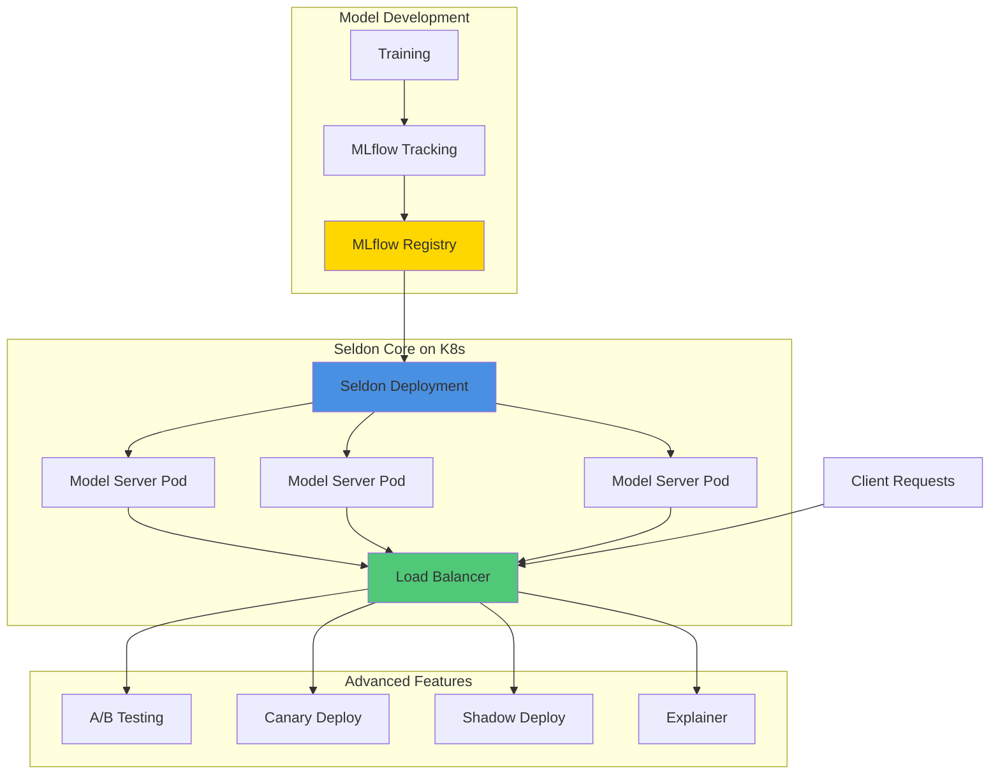

# 07 - MLflow & Seldon Core Integration

## Overview
Seldon Core is a production-grade model serving platform for Kubernetes. Integrating MLflow with Seldon enables seamless deployment of MLflow models to Kubernetes with advanced features like A/B testing, canary deployments, and explainability.

## Architecture



## Prerequisites

### Install Seldon Core on Kubernetes
```bash
# Install Istio (required for Seldon)
kubectl create namespace istio-system
kubectl apply -f https://github.com/istio/istio/releases/download/1.20.0/istio-1.20.0-linux-amd64.tar.gz

istioctl install --set profile=demo -y

# Label namespace for Istio injection
kubectl label namespace default istio-injection=enabled

# Install Seldon Core Operator
kubectl create namespace seldon-system

helm install seldon-core seldon-core-operator \
    --repo https://storage.googleapis.com/seldon-charts \
    --set usageMetrics.enabled=false \
    --set istio.enabled=true \
    --namespace seldon-system

# Verify installation
kubectl get pods -n seldon-system
```

### Install Seldon MLflow Server
```bash
# Seldon provides pre-built MLflow server
# We'll use this in our deployments
```

## Basic MLflow Model Deployment to Seldon

### 1. Train and Register Model
```python
import mlflow
import mlflow.sklearn
from sklearn.datasets import load_iris
from sklearn.ensemble import RandomForestClassifier
from sklearn.model_selection import train_test_split

mlflow.set_tracking_uri("http://mlflow-service.mlflow:5000")
mlflow.set_experiment("seldon-deployment")

# Train model
iris = load_iris()
X_train, X_test, y_train, y_test = train_test_split(
    iris.data, iris.target, test_size=0.2, random_state=42
)

with mlflow.start_run():
    model = RandomForestClassifier(n_estimators=100)
    model.fit(X_train, y_train)
    
    # Log model with signature
    from mlflow.models import infer_signature
    signature = infer_signature(X_train, model.predict(X_train))
    
    mlflow.sklearn.log_model(
        model,
        "model",
        signature=signature,
        registered_model_name="iris-classifier-seldon"
    )
    
    accuracy = model.score(X_test, y_test)
    mlflow.log_metric("accuracy", accuracy)
    
    print(f"Model logged with accuracy: {accuracy:.4f}")
```

### 2. Create Seldon Deployment Manifest
```yaml
# iris-seldon-deployment.yaml
apiVersion: machinelearning.seldon.io/v1
kind: SeldonDeployment
metadata:
  name: iris-classifier
  namespace: default
spec:
  predictors:
  - name: default
    replicas: 3
    graph:
      name: classifier
      implementation: MLFLOW_SERVER
      modelUri: models:/iris-classifier-seldon/Production
      envSecretRefName: seldon-mlflow-secret
    componentSpecs:
    - spec:
        containers:
        - name: classifier
          image: seldonio/mlflowserver:1.14.0
          env:
          - name: MLFLOW_TRACKING_URI
            value: "http://mlflow-service.mlflow:5000"
          resources:
            requests:
              memory: "1Gi"
              cpu: "500m"
            limits:
              memory: "2Gi"
              cpu: "1000m"
```

### 3. Create MLflow Credentials Secret
```bash
# Create secret for MLflow access (if authentication enabled)
kubectl create secret generic seldon-mlflow-secret \
  --from-literal=MLFLOW_TRACKING_URI=http://mlflow-service.mlflow:5000 \
  --from-literal=AWS_ACCESS_KEY_ID=minio \
  --from-literal=AWS_SECRET_ACCESS_KEY=minio123 \
  --from-literal=MLFLOW_S3_ENDPOINT_URL=http://minio-service.mlflow:9000

# Or using YAML
cat <<EOF | kubectl apply -f -
apiVersion: v1
kind: Secret
metadata:
  name: seldon-mlflow-secret
type: Opaque
stringData:
  MLFLOW_TRACKING_URI: "http://mlflow-service.mlflow:5000"
  AWS_ACCESS_KEY_ID: "minio"
  AWS_SECRET_ACCESS_KEY: "minio123"
  MLFLOW_S3_ENDPOINT_URL: "http://minio-service.mlflow:9000"
EOF
```

### 4. Deploy to Seldon
```bash
# Apply deployment
kubectl apply -f iris-seldon-deployment.yaml

# Check status
kubectl get seldondeployments
kubectl get pods -l seldon-deployment-id=iris-classifier

# Wait for ready
kubectl wait --for=condition=ready \
  --timeout=300s \
  seldondeployment/iris-classifier

# Get endpoint
kubectl get svc -l seldon-deployment-id=iris-classifier
```

### 5. Test Deployment
```bash
# Port forward for local testing
kubectl port-forward svc/iris-classifier-default 8080:8080

# Test with curl
curl -X POST http://localhost:8080/api/v1.0/predictions \
  -H 'Content-Type: application/json' \
  -d '{
    "data": {
      "ndarray": [[5.1, 3.5, 1.4, 0.2]]
    }
  }'

# Python test
import requests
import json

url = "http://localhost:8080/api/v1.0/predictions"
data = {
    "data": {
        "ndarray": [[5.1, 3.5, 1.4, 0.2], [6.2, 2.9, 4.3, 1.3]]
    }
}

response = requests.post(url, json=data)
print(json.dumps(response.json(), indent=2))
```

## Advanced Deployment Patterns

### A/B Testing
```yaml
# ab-test-deployment.yaml
apiVersion: machinelearning.seldon.io/v1
kind: SeldonDeployment
metadata:
  name: iris-ab-test
spec:
  predictors:
  # Model A - Current production model
  - name: model-a
    replicas: 2
    traffic: 80  # 80% of traffic
    graph:
      name: classifier-a
      implementation: MLFLOW_SERVER
      modelUri: models:/iris-classifier-seldon/Production
      envSecretRefName: seldon-mlflow-secret
    componentSpecs:
    - spec:
        containers:
        - name: classifier-a
          image: seldonio/mlflowserver:1.14.0
          env:
          - name: MLFLOW_TRACKING_URI
            value: "http://mlflow-service.mlflow:5000"
  
  # Model B - New challenger model
  - name: model-b
    replicas: 2
    traffic: 20  # 20% of traffic
    graph:
      name: classifier-b
      implementation: MLFLOW_SERVER
      modelUri: models:/iris-classifier-seldon/Staging
      envSecretRefName: seldon-mlflow-secret
    componentSpecs:
    - spec:
        containers:
        - name: classifier-b
          image: seldonio/mlflowserver:1.14.0
          env:
          - name: MLFLOW_TRACKING_URI
            value: "http://mlflow-service.mlflow:5000"
```

### Canary Deployment
```yaml
# canary-deployment.yaml
apiVersion: machinelearning.seldon.io/v1
kind: SeldonDeployment
metadata:
  name: iris-canary
spec:
  predictors:
  # Main production model
  - name: production
    replicas: 3
    traffic: 95
    graph:
      name: classifier
      implementation: MLFLOW_SERVER
      modelUri: models:/iris-classifier-seldon/Production
      envSecretRefName: seldon-mlflow-secret
    componentSpecs:
    - spec:
        containers:
        - name: classifier
          image: seldonio/mlflowserver:1.14.0
  
  # Canary version (new model)
  - name: canary
    replicas: 1
    traffic: 5  # Only 5% traffic initially
    graph:
      name: classifier-canary
      implementation: MLFLOW_SERVER
      modelUri: models:/iris-classifier-seldon/Staging
      envSecretRefName: seldon-mlflow-secret
    componentSpecs:
    - spec:
        containers:
        - name: classifier-canary
          image: seldonio/mlflowserver:1.14.0
```

### Shadow Deployment
```yaml
# shadow-deployment.yaml
apiVersion: machinelearning.seldon.io/v1
kind: SeldonDeployment
metadata:
  name: iris-shadow
spec:
  predictors:
  - name: production
    replicas: 2
    graph:
      name: classifier
      implementation: MLFLOW_SERVER
      modelUri: models:/iris-classifier-seldon/Production
      envSecretRefName: seldon-mlflow-secret
      
      # Shadow model - receives copy of traffic but doesn't respond
      shadow: true
      children:
      - name: shadow-model
        implementation: MLFLOW_SERVER
        modelUri: models:/iris-classifier-seldon/Staging
        envSecretRefName: seldon-mlflow-secret
    
    componentSpecs:
    - spec:
        containers:
        - name: classifier
          image: seldonio/mlflowserver:1.14.0
        - name: shadow-model
          image: seldonio/mlflowserver:1.14.0
```

## Custom Seldon Model Server

For advanced preprocessing or custom logic:

```python
# custom_model.py
import mlflow.pyfunc
import numpy as np
from typing import Dict, List, Union

class MLflowSeldonModel:
    """
    Custom Seldon model wrapper for MLflow models
    with preprocessing and postprocessing
    """
    
    def __init__(self, model_uri: str):
        self.model_uri = model_uri
        self.model = None
        self.ready = False
    
    def load(self):
        """Load model on server startup"""
        print(f"Loading model from {self.model_uri}")
        self.model = mlflow.pyfunc.load_model(self.model_uri)
        self.ready = True
        print("Model loaded successfully")
    
    def predict(
        self,
        X: np.ndarray,
        features_names: List[str] = None,
        meta: Dict = None
    ) -> Union[np.ndarray, List, Dict]:
        """
        Predict method called by Seldon Core
        
        Args:
            X: Input data
            features_names: Feature names
            meta: Request metadata
        
        Returns:
            Predictions
        """
        if not self.ready:
            raise RuntimeError("Model not loaded")
        
        # Custom preprocessing
        X_processed = self._preprocess(X)
        
        # Make predictions
        predictions = self.model.predict(X_processed)
        
        # Custom postprocessing
        results = self._postprocess(predictions)
        
        return results
    
    def _preprocess(self, X: np.ndarray) -> np.ndarray:
        """Custom preprocessing logic"""
        # Example: normalize inputs
        # X_normalized = (X - X.mean(axis=0)) / X.std(axis=0)
        return X
    
    def _postprocess(self, predictions: np.ndarray) -> np.ndarray:
        """Custom postprocessing logic"""
        # Example: convert to probabilities
        return predictions
    
    def health_status(self) -> Dict:
        """Health check endpoint"""
        return {
            "ready": self.ready,
            "model_uri": self.model_uri
        }

# For Seldon to use this class
if __name__ == "__main__":
    import os
    model_uri = os.getenv("MODEL_URI", "models:/iris-classifier-seldon/Production")
    model = MLflowSeldonModel(model_uri)
    model.load()
```

### Dockerfile for Custom Model
```dockerfile
# Dockerfile.seldon-mlflow
FROM python:3.10-slim

# Install dependencies
RUN pip install \
    mlflow \
    seldon-core \
    scikit-learn \
    boto3 \
    psycopg2-binary

# Copy custom model code
COPY custom_model.py /app/custom_model.py

WORKDIR /app

# Environment variables
ENV MODEL_NAME MLflowSeldonModel
ENV SERVICE_TYPE MODEL

# Seldon will run this
CMD seldon-core-microservice $MODEL_NAME --service-type $SERVICE_TYPE
```

### Deploy Custom Model
```yaml
# custom-model-deployment.yaml
apiVersion: machinelearning.seldon.io/v1
kind: SeldonDeployment
metadata:
  name: iris-custom
spec:
  predictors:
  - name: default
    replicas: 2
    graph:
      name: classifier
      type: MODEL
      endpoint:
        type: REST
      children: []
    componentSpecs:
    - spec:
        containers:
        - name: classifier
          image: your-registry/seldon-mlflow-custom:latest
          env:
          - name: MODEL_URI
            value: "models:/iris-classifier-seldon/Production"
          - name: MLFLOW_TRACKING_URI
            value: "http://mlflow-service.mlflow:5000"
          envFrom:
          - secretRef:
              name: seldon-mlflow-secret
```

## Model Explainability with Seldon Alibi

```yaml
# explainer-deployment.yaml
apiVersion: machinelearning.seldon.io/v1
kind: SeldonDeployment
metadata:
  name: iris-explainer
spec:
  predictors:
  - name: default
    replicas: 1
    graph:
      name: classifier
      implementation: MLFLOW_SERVER
      modelUri: models:/iris-classifier-seldon/Production
      envSecretRefName: seldon-mlflow-secret
      
      # Add explainer
      explainer:
        type: AnchorTabular
        modelUri: gs://seldon-models/sklearn/iris
    
    componentSpecs:
    - spec:
        containers:
        - name: classifier
          image: seldonio/mlflowserver:1.14.0
        - name: explainer
          image: seldonio/alibi-explain-server:1.14.0
```

## Monitoring and Metrics

### Prometheus Metrics
Seldon automatically exposes Prometheus metrics:

```yaml
# servicemonitor.yaml
apiVersion: monitoring.coreos.com/v1
kind: ServiceMonitor
metadata:
  name: iris-classifier-metrics
spec:
  selector:
    matchLabels:
      seldon-deployment-id: iris-classifier
  endpoints:
  - port: metrics
    interval: 30s
```

### Request Logging
```yaml
# deployment-with-logging.yaml
apiVersion: machinelearning.seldon.io/v1
kind: SeldonDeployment
metadata:
  name: iris-logging
spec:
  predictors:
  - name: default
    replicas: 2
    graph:
      name: classifier
      implementation: MLFLOW_SERVER
      modelUri: models:/iris-classifier-seldon/Production
      
      # Enable request logging
      logger:
        mode: all  # all, request, response
        url: http://message-broker:8080
    
    componentSpecs:
    - spec:
        containers:
        - name: classifier
          image: seldonio/mlflowserver:1.14.0
```

## Automated Deployment Pipeline

### GitOps with ArgoCD
```yaml
# argocd-application.yaml
apiVersion: argoproj.io/v1alpha1
kind: Application
metadata:
  name: iris-classifier
  namespace: argocd
spec:
  project: default
  source:
    repoURL: https://github.com/your-org/ml-deployments
    targetRevision: HEAD
    path: seldon/iris-classifier
  destination:
    server: https://kubernetes.default.svc
    namespace: default
  syncPolicy:
    automated:
      prune: true
      selfHeal: true
```

### CI/CD Integration
```python
# deploy_to_seldon.py
import mlflow
from mlflow.tracking import MlflowClient
import yaml
import subprocess
from typing import Optional

def deploy_model_to_seldon(
    model_name: str,
    stage: str = "Production",
    replicas: int = 3,
    namespace: str = "default"
) -> None:
    """
    Deploy MLflow model to Seldon Core
    """
    client = MlflowClient()
    
    # Get model version
    versions = client.get_latest_versions(model_name, stages=[stage])
    if not versions:
        raise ValueError(f"No model found in stage: {stage}")
    
    version = versions[0].version
    model_uri = f"models:/{model_name}/{stage}"
    
    print(f"Deploying {model_name} version {version} from {stage}")
    
    # Generate Seldon deployment manifest
    deployment = {
        "apiVersion": "machinelearning.seldon.io/v1",
        "kind": "SeldonDeployment",
        "metadata": {
            "name": model_name.lower().replace("_", "-"),
            "namespace": namespace
        },
        "spec": {
            "predictors": [{
                "name": "default",
                "replicas": replicas,
                "graph": {
                    "name": "classifier",
                    "implementation": "MLFLOW_SERVER",
                    "modelUri": model_uri,
                    "envSecretRefName": "seldon-mlflow-secret"
                },
                "componentSpecs": [{
                    "spec": {
                        "containers": [{
                            "name": "classifier",
                            "image": "seldonio/mlflowserver:1.14.0",
                            "env": [{
                                "name": "MLFLOW_TRACKING_URI",
                                "value": "http://mlflow-service.mlflow:5000"
                            }],
                            "resources": {
                                "requests": {"memory": "1Gi", "cpu": "500m"},
                                "limits": {"memory": "2Gi", "cpu": "1000m"}
                            }
                        }]
                    }
                }]
            }]
        }
    }
    
    # Write manifest
    manifest_file = f"{model_name}-seldon.yaml"
    with open(manifest_file, 'w') as f:
        yaml.dump(deployment, f)
    
    # Apply to Kubernetes
    result = subprocess.run(
        ["kubectl", "apply", "-f", manifest_file],
        capture_output=True,
        text=True
    )
    
    if result.returncode == 0:
        print(f"✓ Deployment successful: {model_name}")
        print(result.stdout)
    else:
        print(f"✗ Deployment failed: {model_name}")
        print(result.stderr)
        raise RuntimeError("Deployment failed")

# Usage
if __name__ == "__main__":
    deploy_model_to_seldon(
        model_name="iris-classifier-seldon",
        stage="Production",
        replicas=3
    )
```

## Performance Optimization

### Model Batching
```yaml
# batching-deployment.yaml
apiVersion: machinelearning.seldon.io/v1
kind: SeldonDeployment
metadata:
  name: iris-batching
spec:
  predictors:
  - name: default
    replicas: 2
    graph:
      name: classifier
      implementation: MLFLOW_SERVER
      modelUri: models:/iris-classifier-seldon/Production
      
      # Enable batching
      parameters:
      - name: max_batch_size
        type: INT
        value: "32"
      - name: batch_timeout
        type: INT
        value: "1000"  # milliseconds
    
    componentSpecs:
    - spec:
        containers:
        - name: classifier
          image: seldonio/mlflowserver:1.14.0
```

---
**Navigation**: [← Previous](06-mlflow-zenml-integration.md) | Next → [08-complete-mlops-pipeline.md](08-complete-mlops-pipeline.md)
