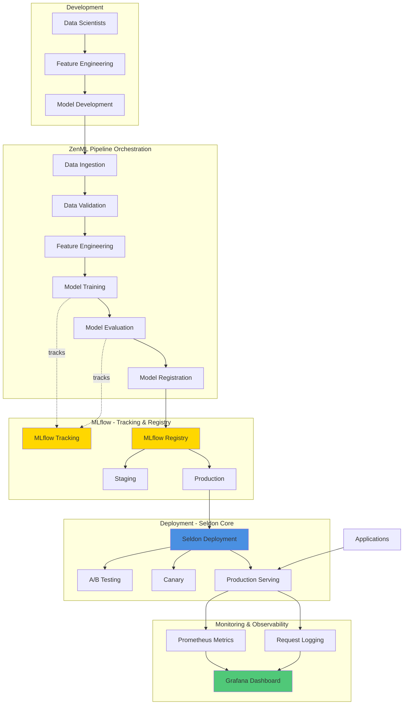

# 08 - Complete MLOps Pipeline: MLflow + ZenML + Seldon

## Overview
This guide demonstrates a production-ready end-to-end MLOps pipeline integrating MLflow (tracking & registry), ZenML (orchestration), and Seldon (serving) on Kubernetes.

## Complete Architecture



## Project Structure

```
mlops-project/
├── pipelines/
│   ├── training_pipeline.py
│   ├── deployment_pipeline.py
│   └── monitoring_pipeline.py
├── steps/
│   ├── data/
│   │   ├── ingestion.py
│   │   └── validation.py
│   ├── training/
│   │   ├── train.py
│   │   └── evaluate.py
│   └── deployment/
│       ├── promote.py
│       └── deploy.py
├── models/
│   └── custom_model.py
├── k8s/
│   ├── mlflow/
│   ├── zenml/
│   └── seldon/
├── monitoring/
│   ├── dashboards/
│   └── alerts/
├── tests/
│   ├── unit/
│   └── integration/
├── config/
│   ├── training_config.yaml
│   └── deployment_config.yaml
├── requirements.txt
└── README.md
```

## Complete Pipeline Implementation

### 1. Configuration Management
```python
# config/config.py
from dataclasses import dataclass
from typing import Optional
import yaml

@dataclass
class MLflowConfig:
    tracking_uri: str = "http://mlflow-service.mlflow:5000"
    experiment_name: str = "production-training"
    registered_model_name: str = "production-model"

@dataclass
class TrainingConfig:
    test_size: float = 0.2
    random_state: int = 42
    n_estimators: int = 100
    max_depth: int = 10
    cv_folds: int = 5

@dataclass
class DeploymentConfig:
    namespace: str = "default"
    replicas: int = 3
    min_accuracy: float = 0.90
    canary_traffic: int = 10
    production_traffic: int = 90

@dataclass
class Config:
    mlflow: MLflowConfig
    training: TrainingConfig
    deployment: DeploymentConfig
    
    @classmethod
    def from_yaml(cls, path: str) -> 'Config':
        with open(path) as f:
            data = yaml.safe_load(f)
        return cls(
            mlflow=MLflowConfig(**data.get('mlflow', {})),
            training=TrainingConfig(**data.get('training', {})),
            deployment=DeploymentConfig(**data.get('deployment', {}))
        )
```

### 2. Data Steps
```python
# steps/data/ingestion.py
from zenml import step
import pandas as pd
from typing import Tuple
from sklearn.model_selection import train_test_split

@step
def load_data(
    data_path: str,
    test_size: float = 0.2,
    random_state: int = 42
) -> Tuple[pd.DataFrame, pd.DataFrame, pd.Series, pd.Series]:
    """Load and split data"""
    
    # Load data from various sources
    df = pd.read_csv(data_path)
    
    # Separate features and target
    X = df.drop('target', axis=1)
    y = df['target']
    
    # Split
    X_train, X_test, y_train, y_test = train_test_split(
        X, y, test_size=test_size, random_state=random_state, stratify=y
    )
    
    return X_train, X_test, y_train, y_test

# steps/data/validation.py
from zenml import step
import pandas as pd
from typing import Dict
import great_expectations as ge

@step
def validate_data(
    X_train: pd.DataFrame,
    X_test: pd.DataFrame
) -> Dict[str, bool]:
    """Validate data quality using Great Expectations"""
    
    # Convert to GE DataFrame
    train_ge = ge.from_pandas(X_train)
    
    # Define expectations
    validation_results = {
        "no_missing_values": train_ge.expect_column_values_to_not_be_null(
            column="feature_1"
        ).success,
        "valid_ranges": train_ge.expect_column_values_to_be_between(
            column="feature_1", min_value=0, max_value=100
        ).success,
        "schema_match": len(X_train.columns) == len(X_test.columns)
    }
    
    # Raise error if validation fails
    if not all(validation_results.values()):
        raise ValueError(f"Data validation failed: {validation_results}")
    
    return validation_results
```

### 3. Feature Engineering
```python
# steps/training/features.py
from zenml import step
import pandas as pd
from sklearn.preprocessing import StandardScaler
from typing import Tuple

@step
def engineer_features(
    X_train: pd.DataFrame,
    X_test: pd.DataFrame
) -> Tuple[pd.DataFrame, pd.DataFrame, StandardScaler]:
    """Feature engineering and preprocessing"""
    
    # Create new features
    X_train_fe = X_train.copy()
    X_test_fe = X_test.copy()
    
    # Example: interaction features
    X_train_fe['feature_interaction'] = X_train_fe['feature_1'] * X_train_fe['feature_2']
    X_test_fe['feature_interaction'] = X_test_fe['feature_1'] * X_test_fe['feature_2']
    
    # Scale features
    scaler = StandardScaler()
    
    numeric_cols = X_train_fe.select_dtypes(include=['float64', 'int64']).columns
    X_train_fe[numeric_cols] = scaler.fit_transform(X_train_fe[numeric_cols])
    X_test_fe[numeric_cols] = scaler.transform(X_test_fe[numeric_cols])
    
    return X_train_fe, X_test_fe, scaler
```

### 4. Model Training with MLflow
```python
# steps/training/train.py
from zenml import step
import mlflow
import mlflow.sklearn
from sklearn.ensemble import RandomForestClassifier
from sklearn.model_selection import cross_val_score
from mlflow.models import infer_signature
import pandas as pd
from typing import Tuple

@step(experiment_tracker="mlflow_tracker")
def train_model(
    X_train: pd.DataFrame,
    y_train: pd.Series,
    n_estimators: int = 100,
    max_depth: int = 10,
    cv_folds: int = 5
) -> Tuple[RandomForestClassifier, str]:
    """Train model with cross-validation and MLflow tracking"""
    
    # Enable autologging
    mlflow.sklearn.autolog(log_model_signatures=True, log_input_examples=True)
    
    with mlflow.start_run() as run:
        # Set tags
        mlflow.set_tag("stage", "training")
        mlflow.set_tag("framework", "zenml")
        
        # Initialize model
        model = RandomForestClassifier(
            n_estimators=n_estimators,
            max_depth=max_depth,
            random_state=42,
            n_jobs=-1
        )
        
        # Cross-validation
        cv_scores = cross_val_score(
            model, X_train, y_train, cv=cv_folds, scoring='accuracy'
        )
        
        # Log CV metrics
        mlflow.log_metric("cv_mean_accuracy", cv_scores.mean())
        mlflow.log_metric("cv_std_accuracy", cv_scores.std())
        
        # Train on full training set
        model.fit(X_train, y_train)
        
        # Log model with signature
        signature = infer_signature(X_train, model.predict(X_train))
        mlflow.sklearn.log_model(
            model,
            "model",
            signature=signature,
            input_example=X_train.iloc[:5]
        )
        
        run_id = run.info.run_id
        
    return model, run_id
```

### 5. Model Evaluation
```python
# steps/training/evaluate.py
from zenml import step
import mlflow
from sklearn.metrics import (
    accuracy_score, precision_score, recall_score, 
    f1_score, roc_auc_score, confusion_matrix
)
import pandas as pd
import numpy as np
from typing import Dict
import matplotlib.pyplot as plt
import seaborn as sns

@step(experiment_tracker="mlflow_tracker")
def evaluate_model(
    model,
    X_test: pd.DataFrame,
    y_test: pd.Series
) -> Dict[str, float]:
    """Comprehensive model evaluation"""
    
    # Predictions
    y_pred = model.predict(X_test)
    y_pred_proba = model.predict_proba(X_test)
    
    # Calculate metrics
    metrics = {
        "test_accuracy": accuracy_score(y_test, y_pred),
        "test_precision": precision_score(y_test, y_pred, average='weighted'),
        "test_recall": recall_score(y_test, y_pred, average='weighted'),
        "test_f1": f1_score(y_test, y_pred, average='weighted'),
        "test_roc_auc": roc_auc_score(
            y_test, y_pred_proba, multi_class='ovr', average='weighted'
        )
    }
    
    # Log all metrics
    mlflow.log_metrics(metrics)
    
    # Create and log confusion matrix
    cm = confusion_matrix(y_test, y_pred)
    fig, ax = plt.subplots(figsize=(10, 8))
    sns.heatmap(cm, annot=True, fmt='d', cmap='Blues', ax=ax)
    ax.set_xlabel('Predicted')
    ax.set_ylabel('Actual')
    ax.set_title('Confusion Matrix')
    mlflow.log_figure(fig, "confusion_matrix.png")
    plt.close()
    
    # Feature importance
    if hasattr(model, 'feature_importances_'):
        importance_df = pd.DataFrame({
            'feature': X_test.columns,
            'importance': model.feature_importances_
        }).sort_values('importance', ascending=False)
        
        fig, ax = plt.subplots(figsize=(10, 6))
        ax.barh(importance_df['feature'][:10], importance_df['importance'][:10])
        ax.set_xlabel('Importance')
        ax.set_title('Top 10 Feature Importances')
        mlflow.log_figure(fig, "feature_importance.png")
        plt.close()
        
        # Log as artifact
        importance_df.to_csv("feature_importance.csv", index=False)
        mlflow.log_artifact("feature_importance.csv")
    
    return metrics
```

### 6. Model Registration
```python
# steps/deployment/register.py
from zenml import step
import mlflow
from mlflow.tracking import MlflowClient
from typing import Optional

@step
def register_model(
    run_id: str,
    model_name: str,
    metrics: dict,
    min_accuracy: float = 0.90
) -> Optional[int]:
    """Register model in MLflow Registry if meets criteria"""
    
    client = MlflowClient()
    
    # Check if model meets criteria
    if metrics['test_accuracy'] < min_accuracy:
        print(f"Model accuracy {metrics['test_accuracy']:.4f} below threshold {min_accuracy}")
        return None
    
    # Register model
    model_uri = f"runs:/{run_id}/model"
    
    try:
        # Try to create registered model
        client.create_registered_model(
            name=model_name,
            description="Production model trained with ZenML pipeline"
        )
    except:
        pass  # Model already exists
    
    # Create model version
    mv = client.create_model_version(
        name=model_name,
        source=model_uri,
        run_id=run_id,
        description=f"Accuracy: {metrics['test_accuracy']:.4f}"
    )
    
    version = int(mv.version)
    
    # Add tags
    client.set_model_version_tag(model_name, version, "validation_status", "passed")
    client.set_model_version_tag(model_name, version, "test_accuracy", str(metrics['test_accuracy']))
    
    # Transition to Staging
    client.transition_model_version_stage(
        name=model_name,
        version=version,
        stage="Staging"
    )
    
    print(f"✓ Model version {version} registered and moved to Staging")
    
    return version
```

### 7. Deployment to Seldon
```python
# steps/deployment/deploy.py
from zenml import step
import subprocess
import yaml
from typing import Dict

@step
def deploy_to_seldon(
    model_name: str,
    version: int,
    namespace: str = "default",
    replicas: int = 3,
    deployment_type: str = "standard"  # standard, canary, ab_test
) -> Dict[str, str]:
    """Deploy model to Seldon Core"""
    
    model_uri = f"models:/{model_name}/Staging"
    deployment_name = f"{model_name.lower().replace('_', '-')}-v{version}"
    
    if deployment_type == "standard":
        deployment = create_standard_deployment(
            deployment_name, model_uri, replicas, namespace
        )
    elif deployment_type == "canary":
        deployment = create_canary_deployment(
            deployment_name, model_uri, replicas, namespace
        )
    else:
        raise ValueError(f"Unknown deployment type: {deployment_type}")
    
    # Write manifest
    manifest_file = f"/tmp/{deployment_name}.yaml"
    with open(manifest_file, 'w') as f:
        yaml.dump(deployment, f)
    
    # Apply to Kubernetes
    result = subprocess.run(
        ["kubectl", "apply", "-f", manifest_file],
        capture_output=True,
        text=True
    )
    
    if result.returncode != 0:
        raise RuntimeError(f"Deployment failed: {result.stderr}")
    
    print(f"✓ Deployed {deployment_name} to Seldon")
    
    return {
        "deployment_name": deployment_name,
        "model_uri": model_uri,
        "namespace": namespace
    }

def create_standard_deployment(name, model_uri, replicas, namespace):
    """Create standard Seldon deployment manifest"""
    return {
        "apiVersion": "machinelearning.seldon.io/v1",
        "kind": "SeldonDeployment",
        "metadata": {
            "name": name,
            "namespace": namespace
        },
        "spec": {
            "predictors": [{
                "name": "default",
                "replicas": replicas,
                "graph": {
                    "name": "classifier",
                    "implementation": "MLFLOW_SERVER",
                    "modelUri": model_uri,
                    "envSecretRefName": "seldon-mlflow-secret"
                },
                "componentSpecs": [{
                    "spec": {
                        "containers": [{
                            "name": "classifier",
                            "image": "seldonio/mlflowserver:1.14.0",
                            "env": [{
                                "name": "MLFLOW_TRACKING_URI",
                                "value": "http://mlflow-service.mlflow:5000"
                            }]
                        }]
                    }
                }]
            }]
        }
    }

def create_canary_deployment(name, model_uri, replicas, namespace):
    """Create canary Seldon deployment manifest"""
    # Implementation similar to standard but with traffic splitting
    pass
```

### 8. Complete Training Pipeline
```python
# pipelines/training_pipeline.py
from zenml import pipeline
from steps.data.ingestion import load_data
from steps.data.validation import validate_data
from steps.training.features import engineer_features
from steps.training.train import train_model
from steps.training.evaluate import evaluate_model
from steps.deployment.register import register_model
from config.config import Config

@pipeline(enable_cache=False)
def training_pipeline(
    data_path: str,
    config: Config
):
    """Complete training pipeline"""
    
    # Data ingestion
    X_train, X_test, y_train, y_test = load_data(
        data_path=data_path,
        test_size=config.training.test_size,
        random_state=config.training.random_state
    )
    
    # Data validation
    validation_results = validate_data(X_train, X_test)
    
    # Feature engineering
    X_train_fe, X_test_fe, scaler = engineer_features(X_train, X_test)
    
    # Training
    model, run_id = train_model(
        X_train_fe,
        y_train,
        n_estimators=config.training.n_estimators,
        max_depth=config.training.max_depth,
        cv_folds=config.training.cv_folds
    )
    
    # Evaluation
    metrics = evaluate_model(model, X_test_fe, y_test)
    
    # Registration
    version = register_model(
        run_id,
        config.mlflow.registered_model_name,
        metrics,
        config.deployment.min_accuracy
    )
    
    return version, metrics
```

### 9. Deployment Pipeline
```python
# pipelines/deployment_pipeline.py
from zenml import pipeline
from steps.deployment.deploy import deploy_to_seldon
from steps.deployment.validate import validate_deployment
from steps.deployment.promote import promote_to_production
from config.config import Config

@pipeline(enable_cache=False)
def deployment_pipeline(
    model_name: str,
    version: int,
    config: Config
):
    """Complete deployment pipeline"""
    
    # Deploy to staging with canary
    deployment_info = deploy_to_seldon(
        model_name=model_name,
        version=version,
        namespace=config.deployment.namespace,
        replicas=config.deployment.replicas,
        deployment_type="canary"
    )
    
    # Validate deployment
    validation_passed = validate_deployment(
        deployment_info['deployment_name'],
        config.deployment.namespace
    )
    
    # Promote to production if validation passes
    if validation_passed:
        promote_to_production(
            model_name,
            version,
            config.deployment.namespace
        )
    
    return deployment_info
```

### 10. Run Complete Pipeline
```python
# run_pipeline.py
from pipelines.training_pipeline import training_pipeline
from pipelines.deployment_pipeline import deployment_pipeline
from config.config import Config
from zenml.client import Client

def main():
    # Load configuration
    config = Config.from_yaml("config/training_config.yaml")
    
    # Configure ZenML
    client = Client()
    client.activate_stack("mlflow_stack")
    
    # Run training pipeline
    print("Starting training pipeline...")
    version, metrics = training_pipeline(
        data_path="data/training_data.csv",
        config=config
    )
    
    print(f"\n✓ Training complete!")
    print(f"Model version: {version}")
    print(f"Metrics: {metrics}")
    
    # Run deployment pipeline if model version created
    if version is not None:
        print(f"\nStarting deployment pipeline for version {version}...")
        deployment_info = deployment_pipeline(
            model_name=config.mlflow.registered_model_name,
            version=version,
            config=config
        )
        print(f"\n✓ Deployment complete!")
        print(f"Deployment info: {deployment_info}")
    else:
        print("\n✗ Model did not meet criteria for deployment")

if __name__ == "__main__":
    main()
```

---
**Navigation**: [← Previous](07-mlflow-seldon-integration.md) | Next → [09-monitoring-observability.md](09-monitoring-observability.md)
