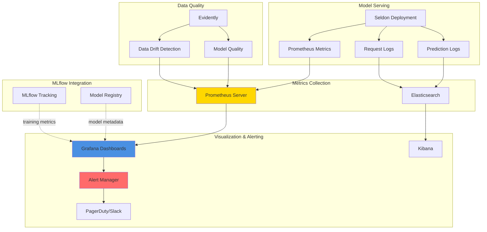

# 09 - Monitoring & Observability

## Overview
Production ML systems require comprehensive monitoring covering model performance, infrastructure health, data quality, and business metrics.

## Monitoring Stack Architecture



## Prometheus Setup for Kubernetes

### Install Prometheus Operator
```bash
# Add Prometheus Helm repo
helm repo add prometheus-community https://prometheus-community.github.io/helm-charts
helm repo update

# Install Prometheus stack (includes Grafana & AlertManager)
helm install prometheus prometheus-community/kube-prometheus-stack \
  --namespace monitoring \
  --create-namespace \
  --set prometheus.prometheusSpec.serviceMonitorSelectorNilUsesHelmValues=false
```

### Service Monitor for MLflow
```yaml
# mlflow-servicemonitor.yaml
apiVersion: monitoring.coreos.com/v1
kind: ServiceMonitor
metadata:
  name: mlflow-metrics
  namespace: mlflow
  labels:
    app: mlflow-server
spec:
  selector:
    matchLabels:
      app: mlflow-server
  endpoints:
  - port: http
    interval: 30s
    path: /metrics
```

### Service Monitor for Seldon
```yaml
# seldon-servicemonitor.yaml
apiVersion: monitoring.coreos.com/v1
kind: ServiceMonitor
metadata:
  name: seldon-models
  namespace: default
  labels:
    app: seldon
spec:
  selector:
    matchLabels:
      seldon-deployment-id: iris-classifier
  endpoints:
  - port: metrics
    interval: 15s
```

## Custom Metrics from Model Server

### Instrumented Model Wrapper
```python
# instrumented_model.py
import mlflow.pyfunc
import numpy as np
from prometheus_client import Counter, Histogram, Gauge
import time
from typing import Dict

# Define metrics
PREDICTION_COUNT = Counter(
    'model_predictions_total',
    'Total number of predictions',
    ['model_name', 'model_version']
)

PREDICTION_LATENCY = Histogram(
    'model_prediction_latency_seconds',
    'Prediction latency in seconds',
    ['model_name', 'model_version'],
    buckets=[0.01, 0.025, 0.05, 0.1, 0.25, 0.5, 1.0, 2.5, 5.0]
)

PREDICTION_ERROR = Counter(
    'model_prediction_errors_total',
    'Total number of prediction errors',
    ['model_name', 'model_version', 'error_type']
)

INPUT_SIZE = Histogram(
    'model_input_size',
    'Size of input batch',
    ['model_name', 'model_version'],
    buckets=[1, 10, 50, 100, 500, 1000]
)

FEATURE_STATS = Gauge(
    'model_feature_value',
    'Feature statistics',
    ['model_name', 'model_version', 'feature_name', 'stat_type']
)

class InstrumentedModel(mlflow.pyfunc.PythonModel):
    """Model wrapper with Prometheus instrumentation"""
    
    def __init__(self, model_name: str, model_version: str):
        self.model_name = model_name
        self.model_version = model_version
        self.model = None
    
    def load_context(self, context):
        """Load the actual model"""
        self.model = mlflow.sklearn.load_model(context.artifacts["model"])
    
    def predict(self, context, model_input):
        """Instrumented prediction"""
        
        # Record input size
        INPUT_SIZE.labels(
            model_name=self.model_name,
            model_version=self.model_version
        ).observe(len(model_input))
        
        # Record feature statistics
        if hasattr(model_input, 'describe'):
            stats = model_input.describe()
            for col in stats.columns:
                FEATURE_STATS.labels(
                    model_name=self.model_name,
                    model_version=self.model_version,
                    feature_name=col,
                    stat_type='mean'
                ).set(stats[col]['mean'])
        
        # Time prediction
        start_time = time.time()
        
        try:
            predictions = self.model.predict(model_input)
            
            # Record successful prediction
            PREDICTION_COUNT.labels(
                model_name=self.model_name,
                model_version=self.model_version
            ).inc(len(model_input))
            
        except Exception as e:
            # Record error
            PREDICTION_ERROR.labels(
                model_name=self.model_name,
                model_version=self.model_version,
                error_type=type(e).__name__
            ).inc()
            raise
        
        finally:
            # Record latency
            duration = time.time() - start_time
            PREDICTION_LATENCY.labels(
                model_name=self.model_name,
                model_version=self.model_version
            ).observe(duration)
        
        return predictions
```

## Data Drift Detection with Evidently

### Setup Evidently Monitoring
```python
# monitoring/drift_detection.py
from evidently import ColumnMapping
from evidently.report import Report
from evidently.metric_preset import DataDriftPreset, DataQualityPreset
from evidently.test_suite import TestSuite
from evidently.test_preset import DataDriftTestPreset
import pandas as pd
import mlflow
from typing import Dict

class DriftDetector:
    """Monitor data drift in production"""
    
    def __init__(self, reference_data: pd.DataFrame):
        self.reference_data = reference_data
        self.column_mapping = ColumnMapping()
    
    def detect_drift(
        self,
        current_data: pd.DataFrame,
        log_to_mlflow: bool = True
    ) -> Dict:
        """Detect data drift between reference and current data"""
        
        # Create drift report
        report = Report(metrics=[
            DataDriftPreset(),
            DataQualityPreset()
        ])
        
        report.run(
            reference_data=self.reference_data,
            current_data=current_data,
            column_mapping=self.column_mapping
        )
        
        # Extract results
        result = report.as_dict()
        
        # Calculate summary metrics
        drift_metrics = {
            'dataset_drift': result['metrics'][0]['result']['dataset_drift'],
            'drift_share': result['metrics'][0]['result']['drift_share'],
            'number_of_drifted_columns': result['metrics'][0]['result']['number_of_drifted_columns']
        }
        
        # Log to MLflow
        if log_to_mlflow:
            with mlflow.start_run(run_name="drift_detection"):
                mlflow.log_metrics(drift_metrics)
                
                # Save HTML report
                report.save_html("drift_report.html")
                mlflow.log_artifact("drift_report.html")
        
        return drift_metrics
    
    def run_drift_tests(self, current_data: pd.DataFrame) -> bool:
        """Run drift tests and return pass/fail"""
        
        test_suite = TestSuite(tests=[
            DataDriftTestPreset()
        ])
        
        test_suite.run(
            reference_data=self.reference_data,
            current_data=current_data,
            column_mapping=self.column_mapping
        )
        
        result = test_suite.as_dict()
        all_passed = result['summary']['all_passed']
        
        return all_passed

# Usage in production
def monitor_production_data():
    """Periodic drift monitoring"""
    
    # Load reference data (training data)
    reference_data = pd.read_csv("reference_data.csv")
    
    # Get recent production data
    production_data = fetch_recent_predictions()  # Your implementation
    
    # Detect drift
    detector = DriftDetector(reference_data)
    drift_metrics = detector.detect_drift(production_data)
    
    if drift_metrics['dataset_drift']:
        print("⚠️ Data drift detected!")
        # Trigger alert or retraining
        trigger_retraining_pipeline()
    
    return drift_metrics
```

### Schedule Drift Detection
```yaml
# drift-detection-cronjob.yaml
apiVersion: batch/v1
kind: CronJob
metadata:
  name: drift-detection
  namespace: default
spec:
  schedule: "0 */6 * * *"  # Every 6 hours
  jobTemplate:
    spec:
      template:
        spec:
          containers:
          - name: drift-detector
            image: your-registry/drift-detector:latest
            env:
            - name: MLFLOW_TRACKING_URI
              value: "http://mlflow-service.mlflow:5000"
            command:
            - python
            - /app/monitor_drift.py
          restartPolicy: OnFailure
```

## Grafana Dashboards

### MLflow Metrics Dashboard
```json
{
  "dashboard": {
    "title": "MLflow Model Performance",
    "panels": [
      {
        "title": "Model Accuracy Over Time",
        "targets": [{
          "expr": "mlflow_metric_accuracy",
          "legendFormat": "{{model_name}} - {{version}}"
        }],
        "type": "graph"
      },
      {
        "title": "Training Duration",
        "targets": [{
          "expr": "mlflow_run_duration_seconds",
          "legendFormat": "{{experiment}}"
        }],
        "type": "graph"
      },
      {
        "title": "Active Experiments",
        "targets": [{
          "expr": "count(mlflow_experiment_active_runs)"
        }],
        "type": "stat"
      },
      {
        "title": "Model Registry Size",
        "targets": [{
          "expr": "sum(mlflow_registered_model_versions)"
        }],
        "type": "stat"
      }
    ]
  }
}
```

### Seldon Model Serving Dashboard
```json
{
  "dashboard": {
    "title": "Model Serving Performance",
    "panels": [
      {
        "title": "Request Rate",
        "targets": [{
          "expr": "rate(seldon_api_executor_client_requests_seconds_count[5m])",
          "legendFormat": "{{deployment_name}}"
        }],
        "type": "graph"
      },
      {
        "title": "Latency (p95, p99)",
        "targets": [
          {
            "expr": "histogram_quantile(0.95, rate(seldon_api_executor_client_requests_seconds_bucket[5m]))",
            "legendFormat": "p95 - {{deployment_name}}"
          },
          {
            "expr": "histogram_quantile(0.99, rate(seldon_api_executor_client_requests_seconds_bucket[5m]))",
            "legendFormat": "p99 - {{deployment_name}}"
          }
        ],
        "type": "graph"
      },
      {
        "title": "Error Rate",
        "targets": [{
          "expr": "rate(seldon_api_executor_client_requests_seconds_count{code!=\"200\"}[5m])",
          "legendFormat": "{{deployment_name}} - {{code}}"
        }],
        "type": "graph"
      },
      {
        "title": "Prediction Count",
        "targets": [{
          "expr": "sum(rate(model_predictions_total[5m])) by (model_name, model_version)",
          "legendFormat": "{{model_name}} v{{model_version}}"
        }],
        "type": "graph"
      },
      {
        "title": "Model Replicas",
        "targets": [{
          "expr": "count(up{job=\"seldon\"}) by (deployment_name)",
          "legendFormat": "{{deployment_name}}"
        }],
        "type": "stat"
      },
      {
        "title": "Memory Usage",
        "targets": [{
          "expr": "container_memory_usage_bytes{container=\"classifier\"} / 1024 / 1024",
          "legendFormat": "{{pod}}"
        }],
        "type": "graph"
      }
    ]
  }
}
```

### Data Drift Dashboard
```json
{
  "dashboard": {
    "title": "Data & Model Quality",
    "panels": [
      {
        "title": "Dataset Drift Detected",
        "targets": [{
          "expr": "evidently_dataset_drift",
          "legendFormat": "{{model_name}}"
        }],
        "type": "stat",
        "thresholds": [
          {"value": 0, "color": "green"},
          {"value": 1, "color": "red"}
        ]
      },
      {
        "title": "Drift Share",
        "targets": [{
          "expr": "evidently_drift_share",
          "legendFormat": "{{model_name}}"
        }],
        "type": "gauge"
      },
      {
        "title": "Feature Drift Over Time",
        "targets": [{
          "expr": "evidently_feature_drift",
          "legendFormat": "{{feature_name}}"
        }],
        "type": "graph"
      },
      {
        "title": "Prediction Distribution",
        "targets": [{
          "expr": "histogram_quantile(0.5, rate(model_prediction_value_bucket[5m]))",
          "legendFormat": "median"
        }],
        "type": "graph"
      }
    ]
  }
}
```

## Alerting Rules

### PrometheusRule for Model Serving
```yaml
# alerting-rules.yaml
apiVersion: monitoring.coreos.com/v1
kind: PrometheusRule
metadata:
  name: model-serving-alerts
  namespace: monitoring
spec:
  groups:
  - name: model_serving
    interval: 30s
    rules:
    
    # High error rate
    - alert: HighPredictionErrorRate
      expr: |
        rate(seldon_api_executor_client_requests_seconds_count{code!="200"}[5m]) 
        / 
        rate(seldon_api_executor_client_requests_seconds_count[5m]) 
        > 0.05
      for: 5m
      labels:
        severity: critical
      annotations:
        summary: "High error rate in model serving"
        description: "Error rate is {{ $value | humanizePercentage }} for {{ $labels.deployment_name }}"
    
    # High latency
    - alert: HighPredictionLatency
      expr: |
        histogram_quantile(0.95, 
          rate(seldon_api_executor_client_requests_seconds_bucket[5m])
        ) > 1.0
      for: 10m
      labels:
        severity: warning
      annotations:
        summary: "High prediction latency"
        description: "P95 latency is {{ $value }}s for {{ $labels.deployment_name }}"
    
    # Model replica down
    - alert: ModelReplicaDown
      expr: |
        up{job="seldon"} == 0
      for: 2m
      labels:
        severity: critical
      annotations:
        summary: "Model replica is down"
        description: "Pod {{ $labels.pod }} is down"
    
    # Low request rate (possible issue)
    - alert: LowRequestRate
      expr: |
        rate(seldon_api_executor_client_requests_seconds_count[5m]) < 0.1
      for: 15m
      labels:
        severity: warning
      annotations:
        summary: "Unusually low request rate"
        description: "Request rate is {{ $value }} req/s for {{ $labels.deployment_name }}"
    
    # Data drift detected
    - alert: DataDriftDetected
      expr: |
        evidently_dataset_drift == 1
      for: 1m
      labels:
        severity: warning
      annotations:
        summary: "Data drift detected"
        description: "Data drift detected for model {{ $labels.model_name }}"
    
    # Model not deployed
    - alert: ModelNotDeployed
      expr: |
        absent(up{job="seldon", deployment_name="iris-classifier"})
      for: 5m
      labels:
        severity: critical
      annotations:
        summary: "Model deployment missing"
        description: "No metrics found for expected deployment"
```

### AlertManager Configuration
```yaml
# alertmanager-config.yaml
apiVersion: v1
kind: Secret
metadata:
  name: alertmanager-config
  namespace: monitoring
stringData:
  alertmanager.yaml: |
    global:
      resolve_timeout: 5m
    
    route:
      group_by: ['alertname', 'severity']
      group_wait: 10s
      group_interval: 10s
      repeat_interval: 12h
      receiver: 'default'
      routes:
      - match:
          severity: critical
        receiver: 'pagerduty'
        continue: true
      - match:
          severity: warning
        receiver: 'slack'
    
    receivers:
    - name: 'default'
      email_configs:
      - to: 'ml-team@company.com'
        from: 'alerts@company.com'
        smarthost: 'smtp.gmail.com:587'
        auth_username: 'alerts@company.com'
        auth_password: 'password'
    
    - name: 'slack'
      slack_configs:
      - api_url: 'https://hooks.slack.com/services/YOUR/SLACK/WEBHOOK'
        channel: '#ml-alerts'
        title: '{{ .GroupLabels.alertname }}'
        text: '{{ range .Alerts }}{{ .Annotations.description }}{{ end }}'
    
    - name: 'pagerduty'
      pagerduty_configs:
      - service_key: 'YOUR_PAGERDUTY_KEY'
        description: '{{ .GroupLabels.alertname }}'
```

## Model Performance Tracking

### Automated Performance Logging
```python
# monitoring/performance_tracker.py
import mlflow
import pandas as pd
from datetime import datetime, timedelta
from typing import Dict, List
import requests

class ProductionPerformanceTracker:
    """Track model performance in production"""
    
    def __init__(self, model_name: str, tracking_uri: str):
        self.model_name = model_name
        mlflow.set_tracking_uri(tracking_uri)
        mlflow.set_experiment(f"{model_name}-production-monitoring")
    
    def log_batch_performance(
        self,
        predictions: List,
        actuals: List,
        metadata: Dict
    ):
        """Log batch performance metrics"""
        
        from sklearn.metrics import accuracy_score, f1_score
        
        with mlflow.start_run(run_name=f"production-{datetime.now().isoformat()}"):
            # Calculate metrics
            accuracy = accuracy_score(actuals, predictions)
            f1 = f1_score(actuals, predictions, average='weighted')
            
            # Log metrics
            mlflow.log_metrics({
                'production_accuracy': accuracy,
                'production_f1': f1,
                'batch_size': len(predictions)
            })
            
            # Log metadata
            mlflow.log_params(metadata)
            
            # Set tags
            mlflow.set_tag('environment', 'production')
            mlflow.set_tag('model_name', self.model_name)
    
    def compare_with_training(self, days_back: int = 7) -> Dict:
        """Compare production metrics with training metrics"""
        
        from mlflow.tracking import MlflowClient
        
        client = MlflowClient()
        
        # Get training metrics
        training_exp = client.get_experiment_by_name(f"{self.model_name}-training")
        training_runs = client.search_runs(
            training_exp.experiment_id,
            order_by=["start_time DESC"],
            max_results=1
        )
        
        training_accuracy = training_runs[0].data.metrics.get('test_accuracy', 0)
        
        # Get recent production metrics
        prod_exp = client.get_experiment_by_name(f"{self.model_name}-production-monitoring")
        
        cutoff_time = int((datetime.now() - timedelta(days=days_back)).timestamp() * 1000)
        prod_runs = client.search_runs(
            prod_exp.experiment_id,
            filter_string=f"attributes.start_time > {cutoff_time}"
        )
        
        if not prod_runs:
            return {'status': 'no_production_data'}
        
        prod_accuracies = [
            run.data.metrics.get('production_accuracy', 0)
            for run in prod_runs
        ]
        
        avg_prod_accuracy = sum(prod_accuracies) / len(prod_accuracies)
        
        # Calculate degradation
        degradation = training_accuracy - avg_prod_accuracy
        
        result = {
            'training_accuracy': training_accuracy,
            'avg_production_accuracy': avg_prod_accuracy,
            'degradation': degradation,
            'degradation_percentage': (degradation / training_accuracy) * 100,
            'samples_evaluated': len(prod_runs)
        }
        
        # Alert if significant degradation
        if abs(degradation) > 0.05:  # 5% threshold
            print(f"⚠️ Model performance degraded by {degradation:.2%}")
            # Trigger retraining or investigation
        
        return result
```

## Logging and Tracing

### Elasticsearch for Request Logging
```yaml
# elasticsearch-deployment.yaml
apiVersion: apps/v1
kind: Deployment
metadata:
  name: elasticsearch
  namespace: monitoring
spec:
  replicas: 1
  selector:
    matchLabels:
      app: elasticsearch
  template:
    metadata:
      labels:
        app: elasticsearch
    spec:
      containers:
      - name: elasticsearch
        image: docker.elastic.co/elasticsearch/elasticsearch:8.11.0
        env:
        - name: discovery.type
          value: single-node
        - name: ES_JAVA_OPTS
          value: "-Xms512m -Xmx512m"
        ports:
        - containerPort: 9200
        volumeMounts:
        - name: es-data
          mountPath: /usr/share/elasticsearch/data
      volumes:
      - name: es-data
        persistentVolumeClaim:
          claimName: elasticsearch-pvc
```

### Seldon Request Logger
```yaml
# request-logger-deployment.yaml
apiVersion: machinelearning.seldon.io/v1
kind: SeldonDeployment
metadata:
  name: iris-with-logging
spec:
  predictors:
  - name: default
    replicas: 2
    graph:
      name: classifier
      implementation: MLFLOW_SERVER
      modelUri: models:/iris-classifier/Production
      
      # Enable request logging to Elasticsearch
      logger:
        mode: all
        url: http://elasticsearch.monitoring:9200/_bulk
    
    componentSpecs:
    - spec:
        containers:
        - name: classifier
          image: seldonio/mlflowserver:1.14.0
```

---
**Navigation**: [← Previous](08-complete-mlops-pipeline.md) | Next → [10-advanced-topics.md](10-advanced-topics.md)
