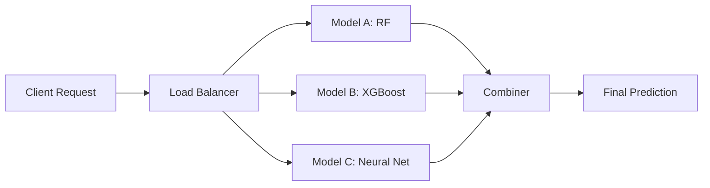

# 10 - Advanced Topics & Production Best Practices

## Overview
Advanced patterns and best practices for production MLOps with MLflow, ZenML, and Seldon at scale.

## Multi-Model Serving

### Ensemble Models with Seldon


```yaml
# ensemble-deployment.yaml
apiVersion: machinelearning.seldon.io/v1
kind: SeldonDeployment
metadata:
  name: iris-ensemble
spec:
  predictors:
  - name: ensemble
    replicas: 2
    graph:
      name: combiner
      implementation: COMBINER_AVERAGE
      children:
      - name: model-rf
        implementation: MLFLOW_SERVER
        modelUri: models:/iris-rf/Production
        envSecretRefName: seldon-mlflow-secret
      - name: model-xgb
        implementation: MLFLOW_SERVER
        modelUri: models:/iris-xgb/Production
        envSecretRefName: seldon-mlflow-secret
      - name: model-nn
        implementation: MLFLOW_SERVER
        modelUri: models:/iris-nn/Production
        envSecretRefName: seldon-mlflow-secret
    
    componentSpecs:
    - spec:
        containers:
        - name: model-rf
          image: seldonio/mlflowserver:1.14.0
        - name: model-xgb
          image: seldonio/mlflowserver:1.14.0
        - name: model-nn
          image: seldonio/mlflowserver:1.14.0
```

### Custom Ensemble Logic
```python
# custom_ensemble.py
import numpy as np
from typing import List, Dict

class WeightedEnsemble:
    """Custom weighted ensemble combiner"""
    
    def __init__(self, weights: List[float] = None):
        self.weights = weights or [1.0, 1.0, 1.0]
        self.weights = np.array(self.weights) / sum(self.weights)
    
    def aggregate(
        self,
        predictions: List[np.ndarray],
        features_names: List[str] = None
    ) -> np.ndarray:
        """
        Aggregate predictions from multiple models
        
        Args:
            predictions: List of prediction arrays from each model
        
        Returns:
            Combined predictions
        """
        # Weighted average for regression/probabilities
        if predictions[0].ndim == 2:  # Probabilities
            weighted_pred = sum(
                p * w for p, w in zip(predictions, self.weights)
            )
            return weighted_pred
        
        # Voting for classification
        else:
            return np.average(predictions, axis=0, weights=self.weights)
    
    def predict(self, X, features_names=None):
        """For Seldon compatibility"""
        return self.aggregate(X, features_names)
```

## Multi-Tenancy & Model Routing

### Model Router Implementation
```python
# model_router.py
import mlflow.pyfunc
from typing import Dict, Any
import numpy as np

class ModelRouter(mlflow.pyfunc.PythonModel):
    """Route requests to different models based on input features"""
    
    def load_context(self, context):
        """Load multiple models"""
        self.models = {
            'model_a': mlflow.pyfunc.load_model(context.artifacts['model_a']),
            'model_b': mlflow.pyfunc.load_model(context.artifacts['model_b']),
            'model_c': mlflow.pyfunc.load_model(context.artifacts['model_c'])
        }
    
    def predict(self, context, model_input, params: Dict[str, Any] = None):
        """Route to appropriate model based on criteria"""
        
        # Extract routing criteria
        if params and 'customer_tier' in params:
            tier = params['customer_tier']
            
            # Route based on business logic
            if tier == 'premium':
                model = self.models['model_a']  # Most accurate, slower
            elif tier == 'standard':
                model = self.models['model_b']  # Balanced
            else:
                model = self.models['model_c']  # Fast, less accurate
        else:
            # Default routing based on input features
            if len(model_input) < 100:
                model = self.models['model_a']
            else:
                model = self.models['model_c']  # Optimized for batch
        
        return model.predict(model_input)
```

### Tenant-Specific Models
```yaml
# multi-tenant-deployment.yaml
apiVersion: machinelearning.seldon.io/v1
kind: SeldonDeployment
metadata:
  name: multi-tenant-model
spec:
  predictors:
  # Tenant A - High performance model
  - name: tenant-a
    replicas: 3
    graph:
      name: model-a
      implementation: MLFLOW_SERVER
      modelUri: models:/tenant-a-model/Production
      envSecretRefName: seldon-mlflow-secret
  
  # Tenant B - Standard model
  - name: tenant-b
    replicas: 2
    graph:
      name: model-b
      implementation: MLFLOW_SERVER
      modelUri: models:/tenant-b-model/Production
      envSecretRefName: seldon-mlflow-secret
---
# Routing via Istio VirtualService
apiVersion: networking.istio.io/v1beta1
kind: VirtualService
metadata:
  name: model-routing
spec:
  hosts:
  - model-service
  http:
  - match:
    - headers:
        tenant:
          exact: tenant-a
    route:
    - destination:
        host: multi-tenant-model-tenant-a
  - match:
    - headers:
        tenant:
          exact: tenant-b
    route:
    - destination:
        host: multi-tenant-model-tenant-b
```

## Feature Store Integration

### Feast Feature Store Setup
```bash
# Install Feast
pip install feast[gcp]  # or [aws], [redis], etc.

# Initialize feature repo
feast init ml_features
cd ml_features
```

### Feature Definitions
```python
# features/definitions.py
from feast import Entity, FeatureView, Field, FileSource
from feast.types import Float32, Int64
from datetime import timedelta

# Define entity
user = Entity(
    name="user",
    join_keys=["user_id"],
    description="User entity"
)

# Define feature source
user_features_source = FileSource(
    path="data/user_features.parquet",
    timestamp_field="event_timestamp"
)

# Define feature view
user_features = FeatureView(
    name="user_features",
    entities=[user],
    ttl=timedelta(days=1),
    schema=[
        Field(name="age", dtype=Int64),
        Field(name="avg_purchase", dtype=Float32),
        Field(name="total_spend", dtype=Float32),
    ],
    source=user_features_source,
)
```

### Integration with Training Pipeline
```python
# steps/features/feast_integration.py
from zenml import step
from feast import FeatureStore
import pandas as pd
from datetime import datetime

@step
def get_features_from_feast(
    entity_ids: pd.DataFrame,
    feature_refs: list
) -> pd.DataFrame:
    """Fetch features from Feast feature store"""
    
    store = FeatureStore(repo_path="ml_features/")
    
    # Get features
    features = store.get_online_features(
        features=feature_refs,
        entity_rows=entity_ids.to_dict('records')
    ).to_df()
    
    return features

# In training pipeline
@pipeline
def training_with_feast():
    # Get entity IDs
    entity_df = load_entity_ids()
    
    # Fetch features from Feast
    features = get_features_from_feast(
        entity_df,
        feature_refs=[
            "user_features:age",
            "user_features:avg_purchase",
            "user_features:total_spend"
        ]
    )
    
    # Continue with training
    model = train_model(features, labels)
```

### Real-time Feature Serving
```python
# model_with_features.py
from feast import FeatureStore
import mlflow.pyfunc

class ModelWithFeatures(mlflow.pyfunc.PythonModel):
    """Model that fetches features at inference time"""
    
    def load_context(self, context):
        self.model = mlflow.sklearn.load_model(context.artifacts['model'])
        self.feature_store = FeatureStore(repo_path="ml_features/")
        self.feature_refs = [
            "user_features:age",
            "user_features:avg_purchase",
            "user_features:total_spend"
        ]
    
    def predict(self, context, model_input):
        """Fetch features and predict"""
        
        # model_input contains entity IDs
        entity_rows = [{"user_id": uid} for uid in model_input['user_id']]
        
        # Fetch features
        features_df = self.feature_store.get_online_features(
            features=self.feature_refs,
            entity_rows=entity_rows
        ).to_df()
        
        # Predict
        predictions = self.model.predict(features_df)
        
        return predictions
```

## Model Versioning Strategies

### Semantic Versioning for Models
```python
# model_versioning.py
from dataclasses import dataclass
from typing import Optional
import mlflow
from mlflow.tracking import MlflowClient

@dataclass
class ModelVersion:
    major: int  # Breaking changes (API, input schema)
    minor: int  # New features, improvements
    patch: int  # Bug fixes, small improvements
    
    def __str__(self):
        return f"{self.major}.{self.minor}.{self.patch}"
    
    @classmethod
    def from_string(cls, version_str: str) -> 'ModelVersion':
        major, minor, patch = map(int, version_str.split('.'))
        return cls(major, minor, patch)

class ModelVersionManager:
    """Manage semantic versioning for models"""
    
    def __init__(self, model_name: str):
        self.model_name = model_name
        self.client = MlflowClient()
    
    def get_latest_version(self) -> ModelVersion:
        """Get latest semantic version"""
        versions = self.client.search_model_versions(
            f"name='{self.model_name}'"
        )
        
        if not versions:
            return ModelVersion(0, 0, 0)
        
        # Get version from tags
        latest = versions[0]
        version_str = latest.tags.get('semantic_version', '0.0.0')
        return ModelVersion.from_string(version_str)
    
    def register_new_version(
        self,
        run_id: str,
        change_type: str = 'patch',  # major, minor, patch
        description: str = ""
    ) -> str:
        """Register new model version with semantic versioning"""
        
        # Get current version
        current = self.get_latest_version()
        
        # Increment version
        if change_type == 'major':
            new_version = ModelVersion(current.major + 1, 0, 0)
        elif change_type == 'minor':
            new_version = ModelVersion(current.major, current.minor + 1, 0)
        else:  # patch
            new_version = ModelVersion(current.major, current.minor, current.patch + 1)
        
        # Register model
        model_uri = f"runs:/{run_id}/model"
        mv = self.client.create_model_version(
            name=self.model_name,
            source=model_uri,
            run_id=run_id,
            description=f"{description} (v{new_version})"
        )
        
        # Tag with semantic version
        self.client.set_model_version_tag(
            self.model_name,
            mv.version,
            "semantic_version",
            str(new_version)
        )
        
        print(f"Registered {self.model_name} version {new_version}")
        
        return str(new_version)
```

## Advanced CI/CD Patterns

### GitOps Model Deployment
```yaml
# .github/workflows/model-deployment.yaml
name: Model Deployment Pipeline

on:
  workflow_dispatch:
    inputs:
      model_name:
        description: 'Model name'
        required: true
      version:
        description: 'Model version'
        required: true
      environment:
        description: 'Target environment'
        required: true
        type: choice
        options:
          - staging
          - production

jobs:
  validate:
    runs-on: ubuntu-latest
    steps:
      - uses: actions/checkout@v3
      
      - name: Setup Python
        uses: actions/setup-python@v4
        with:
          python-version: '3.10'
      
      - name: Install dependencies
        run: |
          pip install mlflow boto3
      
      - name: Validate model
        env:
          MLFLOW_TRACKING_URI: ${{ secrets.MLFLOW_TRACKING_URI }}
        run: |
          python scripts/validate_model.py \
            --model-name ${{ inputs.model_name }} \
            --version ${{ inputs.version }}
  
  deploy-staging:
    needs: validate
    if: inputs.environment == 'staging'
    runs-on: ubuntu-latest
    steps:
      - uses: actions/checkout@v3
      
      - name: Configure kubectl
        uses: azure/k8s-set-context@v3
        with:
          kubeconfig: ${{ secrets.KUBECONFIG }}
      
      - name: Deploy to staging
        run: |
          python scripts/deploy_to_seldon.py \
            --model-name ${{ inputs.model_name }} \
            --version ${{ inputs.version }} \
            --namespace staging \
            --replicas 1
      
      - name: Run smoke tests
        run: |
          python scripts/smoke_test.py \
            --deployment-url https://staging.models.company.com \
            --model-name ${{ inputs.model_name }}
  
  deploy-production:
    needs: validate
    if: inputs.environment == 'production'
    runs-on: ubuntu-latest
    environment:
      name: production
      url: https://models.company.com
    steps:
      - uses: actions/checkout@v3
      
      - name: Configure kubectl
        uses: azure/k8s-set-context@v3
        with:
          kubeconfig: ${{ secrets.KUBECONFIG_PROD }}
      
      - name: Deploy canary (10%)
        run: |
          python scripts/deploy_canary.py \
            --model-name ${{ inputs.model_name }} \
            --version ${{ inputs.version }} \
            --traffic 10
      
      - name: Monitor canary metrics
        run: |
          python scripts/monitor_canary.py \
            --duration 300 \
            --error-threshold 0.01
      
      - name: Promote to production
        if: success()
        run: |
          python scripts/promote_to_production.py \
            --model-name ${{ inputs.model_name }} \
            --version ${{ inputs.version }}
      
      - name: Rollback on failure
        if: failure()
        run: |
          python scripts/rollback_deployment.py \
            --model-name ${{ inputs.model_name }}
```

## Cost Optimization

### Auto-scaling Based on Load
```yaml
# hpa-cpu-and-custom.yaml
apiVersion: autoscaling/v2
kind: HorizontalPodAutoscaler
metadata:
  name: model-autoscaler
spec:
  scaleTargetRef:
    apiVersion: apps/v1
    kind: Deployment
    name: iris-classifier
  minReplicas: 2
  maxReplicas: 20
  metrics:
  # CPU-based scaling
  - type: Resource
    resource:
      name: cpu
      target:
        type: Utilization
        averageUtilization: 70
  
  # Custom metric: request rate
  - type: Pods
    pods:
      metric:
        name: requests_per_second
      target:
        type: AverageValue
        averageValue: "100"
  
  # Custom metric: queue depth
  - type: External
    external:
      metric:
        name: sqs_queue_depth
        selector:
          matchLabels:
            queue: model-predictions
      target:
        type: Value
        value: "50"
  
  behavior:
    scaleDown:
      stabilizationWindowSeconds: 300
      policies:
      - type: Percent
        value: 50
        periodSeconds: 60
    scaleUp:
      stabilizationWindowSeconds: 0
      policies:
      - type: Percent
        value: 100
        periodSeconds: 30
      - type: Pods
        value: 4
        periodSeconds: 30
      selectPolicy: Max
```

### Model Caching Strategy
```python
# model_cache.py
import mlflow.pyfunc
from functools import lru_cache
import hashlib
import pickle
from typing import Optional
import redis

class ModelCache:
    """Cache model predictions to reduce compute costs"""
    
    def __init__(self, redis_host: str = "localhost", redis_port: int = 6379):
        self.redis_client = redis.Redis(
            host=redis_host,
            port=redis_port,
            decode_responses=False
        )
        self.ttl = 3600  # 1 hour
    
    def get_cache_key(self, model_input) -> str:
        """Generate cache key from input"""
        input_hash = hashlib.sha256(
            pickle.dumps(model_input)
        ).hexdigest()
        return f"prediction:{input_hash}"
    
    def get(self, model_input) -> Optional:
        """Get prediction from cache"""
        key = self.get_cache_key(model_input)
        cached = self.redis_client.get(key)
        
        if cached:
            return pickle.loads(cached)
        return None
    
    def set(self, model_input, prediction):
        """Store prediction in cache"""
        key = self.get_cache_key(model_input)
        self.redis_client.setex(
            key,
            self.ttl,
            pickle.dumps(prediction)
        )

class CachedModel(mlflow.pyfunc.PythonModel):
    """Model wrapper with caching"""
    
    def load_context(self, context):
        self.model = mlflow.sklearn.load_model(context.artifacts['model'])
        self.cache = ModelCache()
    
    def predict(self, context, model_input):
        # Try cache first
        cached_pred = self.cache.get(model_input)
        if cached_pred is not None:
            return cached_pred
        
        # Compute prediction
        prediction = self.model.predict(model_input)
        
        # Cache result
        self.cache.set(model_input, prediction)
        
        return prediction
```

## Security Best Practices

### Model Encryption
```python
# secure_model.py
from cryptography.fernet import Fernet
import mlflow.pyfunc
import pickle

class EncryptedModel:
    """Encrypt model artifacts at rest"""
    
    def __init__(self, encryption_key: bytes):
        self.fernet = Fernet(encryption_key)
    
    def encrypt_model(self, model_path: str, output_path: str):
        """Encrypt model file"""
        with open(model_path, 'rb') as f:
            model_data = f.read()
        
        encrypted = self.fernet.encrypt(model_data)
        
        with open(output_path, 'wb') as f:
            f.write(encrypted)
    
    def decrypt_model(self, encrypted_path: str):
        """Decrypt and load model"""
        with open(encrypted_path, 'rb') as f:
            encrypted_data = f.read()
        
        decrypted = self.fernet.decrypt(encrypted_data)
        return pickle.loads(decrypted)

# Use in MLflow
class SecureModelWrapper(mlflow.pyfunc.PythonModel):
    def load_context(self, context):
        import os
        encryption_key = os.getenv('MODEL_ENCRYPTION_KEY').encode()
        
        secure_loader = EncryptedModel(encryption_key)
        self.model = secure_loader.decrypt_model(
            context.artifacts['encrypted_model']
        )
    
    def predict(self, context, model_input):
        return self.model.predict(model_input)
```

### Network Policies
```yaml
# strict-network-policy.yaml
apiVersion: networking.k8s.io/v1
kind: NetworkPolicy
metadata:
  name: model-serving-policy
spec:
  podSelector:
    matchLabels:
      app: model-server
  policyTypes:
  - Ingress
  - Egress
  
  ingress:
  # Only allow from API gateway
  - from:
    - podSelector:
        matchLabels:
          app: api-gateway
    ports:
    - protocol: TCP
      port: 8080
  
  egress:
  # Allow MLflow tracking
  - to:
    - podSelector:
        matchLabels:
          app: mlflow-server
    ports:
    - protocol: TCP
      port: 5000
  
  # Allow S3/MinIO for artifacts
  - to:
    - podSelector:
        matchLabels:
          app: minio
    ports:
    - protocol: TCP
      port: 9000
  
  # DNS
  - to:
    - namespaceSelector: {}
      podSelector:
        matchLabels:
          k8s-app: kube-dns
    ports:
    - protocol: UDP
      port: 53
```

---
**Navigation**: [← Previous](09-monitoring-observability.md) | Next → [Best Practices](best-practices/README.md)
