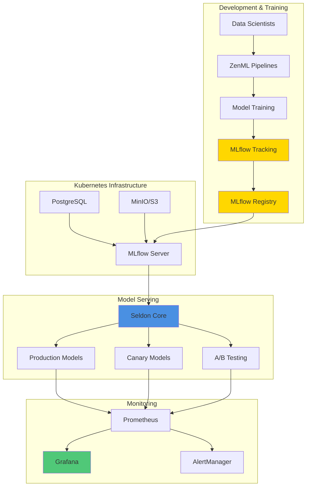

# MLflow Learning Path: Beginner to Pro

A comprehensive guide to mastering MLflow with Kubernetes, ZenML, and Seldon Core for production MLOps.

## 📚 Learning Path Overview

This learning path takes you from MLflow fundamentals to building production-grade ML systems running on Kubernetes with integrated orchestration (ZenML) and model serving (Seldon Core).

### Target Audience
- ML Engineers looking to production-ize models
- Data Scientists wanting to understand MLOps
- DevOps engineers working with ML systems
- Teams building scalable ML platforms

## 📖 Course Structure

### Beginner Level (Lessons 1-4)
Get started with MLflow basics, tracking, and model management.

**[01 - MLflow Fundamentals](01-mlflow-fundamentals.md)**
- Core components: Tracking, Projects, Models, Registry
- Installation and setup
- First tracking example
- MLflow UI
- Directory structure and environment variables

**[02 - MLflow Tracking Advanced](02-mlflow-tracking-advanced.md)**
- Backend store configuration (SQLite, PostgreSQL)
- Artifact storage (S3, Azure, GCS)
- Autologging for popular frameworks
- Nested runs for complex workflows
- Model signatures and input examples
- Custom metrics and step-wise logging

**[03 - MLflow Models & Model Registry](03-mlflow-models-registry.md)**
- Model registration strategies
- Version management and lifecycle stages
- Loading models from registry
- Model aliasing (MLflow 2.0+)
- Model approval workflows
- Webhooks and notifications

**[04 - MLflow Deployment Patterns](04-mlflow-deployment.md)**
- Local serving
- Docker containerization
- Cloud deployments (AWS, Azure, GCP)
- Batch inference patterns
- Performance optimization

### Intermediate Level (Lessons 5-7)
Scale to Kubernetes and integrate orchestration and serving.

**[05 - MLflow on Kubernetes](05-mlflow-kubernetes.md)**
- Complete K8s architecture
- PostgreSQL and MinIO setup
- MLflow tracking server deployment
- High availability configuration
- Training jobs on Kubernetes
- Monitoring and observability

**[06 - MLflow & ZenML Integration](06-mlflow-zenml-integration.md)**
- ZenML installation and configuration
- Pipeline creation with MLflow tracking
- Advanced pipelines with model registry
- Hyperparameter tuning
- Kubernetes orchestration
- Resource management

**[07 - MLflow & Seldon Core Integration](07-mlflow-seldon-integration.md)**
- Seldon Core installation
- Deploying MLflow models to Seldon
- A/B testing and canary deployments
- Custom model servers
- Model explainability
- Performance optimization

### Advanced Level (Lessons 8-10)
Build complete production MLOps systems.

**[08 - Complete MLOps Pipeline](08-complete-mlops-pipeline.md)**
- End-to-end architecture
- Configuration management
- Data validation and feature engineering
- Model training with cross-validation
- Automated model registration
- Deployment to Seldon
- Complete pipeline orchestration

**[09 - Monitoring & Observability](09-monitoring-observability.md)**
- Prometheus setup and metrics
- Custom instrumentation
- Data drift detection with Evidently
- Grafana dashboards
- Alerting rules and notifications
- Production performance tracking
- Request logging with Elasticsearch

**[10 - Advanced Topics](10-advanced-topics.md)**
- Multi-model serving and ensembles
- Model routing and multi-tenancy
- Feature store integration (Feast)
- Semantic versioning for models
- GitOps model deployment
- Cost optimization strategies
- Security best practices

**[11 - MLflow Best Practices](best-practices/README.md)** ⭐ Must-Read
- [Practice 1: Names and Stages](best-practices/01-names-and-stages.md)
- [Practice 2: Model Signatures](best-practices/02-model-signatures.md)  
- [Practice 3: Promotion Gates](best-practices/03-promotion-gates.md)
- [Practice 4: Rollbacks](best-practices/04-rollbacks.md)
- [Practice 5: Complete Logging](best-practices/05-complete-logging.md)
- [Practice 6: Model/Policy Separation](best-practices/06-model-policy-separation.md)
- [Practice 7: Shadow & Ramp](best-practices/07-shadow-and-ramp.md)
- [Full Detailed Guide](best-practices/FULL_GUIDE.md)

## 🏗️ Architecture Overview



## 🛠️ Tech Stack

- **MLflow**: Experiment tracking, model registry, and lifecycle management
- **ZenML**: Pipeline orchestration and MLOps framework
- **Seldon Core**: Production model serving on Kubernetes
- **Kubernetes**: Container orchestration
- **PostgreSQL**: MLflow backend store
- **MinIO/S3**: Artifact storage
- **Prometheus**: Metrics collection
- **Grafana**: Visualization and dashboards
- **Evidently**: Data drift detection

## 🚀 Quick Start

### Prerequisites
```bash
# Install core tools
pip install mlflow zenml seldon-core

# Kubernetes cluster (minikube, kind, or cloud)
kubectl cluster-info

# Helm for K8s package management
helm version
```

### Run Your First Pipeline
```python
import mlflow
from sklearn.ensemble import RandomForestClassifier
from sklearn.datasets import load_iris

mlflow.set_tracking_uri("http://localhost:5000")

with mlflow.start_run():
    iris = load_iris()
    model = RandomForestClassifier()
    model.fit(iris.data, iris.target)
    
    mlflow.log_param("n_estimators", 100)
    mlflow.log_metric("accuracy", model.score(iris.data, iris.target))
    mlflow.sklearn.log_model(model, "model")
```

## 📊 Learning Objectives

By completing this course, you will be able to:

✅ Set up and configure MLflow for experiment tracking  
✅ Manage model lifecycle with MLflow Registry  
✅ Deploy MLflow on Kubernetes with high availability  
✅ Build reproducible ML pipelines with ZenML  
✅ Deploy models to production with Seldon Core  
✅ Implement A/B testing and canary deployments  
✅ Monitor model performance and data drift  
✅ Set up comprehensive observability and alerting  
✅ Apply production MLOps best practices  
✅ Scale ML systems to handle enterprise workloads

## 🎯 Real-World Applications

The patterns in this course are used for:

- **E-commerce**: Product recommendation systems, demand forecasting
- **Finance**: Fraud detection, credit scoring, algorithmic trading
- **Healthcare**: Disease prediction, patient risk assessment
- **Manufacturing**: Predictive maintenance, quality control
- **Marketing**: Customer churn prediction, campaign optimization

## 📝 Hands-On Projects

Each lesson includes:
- ✍️ Code examples you can run
- 🏗️ Architecture diagrams
- 🔧 Configuration files
- 🧪 Testing strategies
- 📈 Monitoring setups

## 🔗 Additional Resources

- [MLflow Documentation](https://mlflow.org/docs/latest/index.html)
- [ZenML Documentation](https://docs.zenml.io/)
- [Seldon Core Documentation](https://docs.seldon.io/)
- [Kubernetes Documentation](https://kubernetes.io/docs/)

## 🤝 Contributing

Found an issue or want to improve the content? Contributions are welcome!

## 📜 License

This learning material is provided as-is for educational purposes.

## 🎓 Next Steps

1. Start with [01 - MLflow Fundamentals](01-mlflow-fundamentals.md)
2. Work through each lesson in order
3. Complete the hands-on examples
4. Build your own production ML system
5. Share your learnings with the community

---

**Ready to become an MLOps pro? Let's get started! 🚀**

[Begin your journey →](01-mlflow-fundamentals.md)
