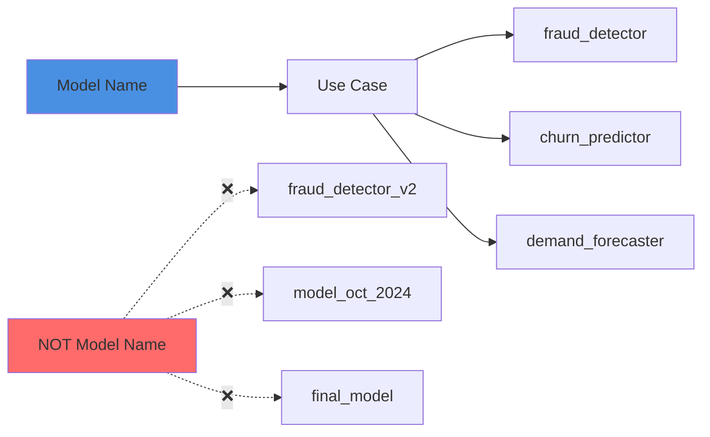
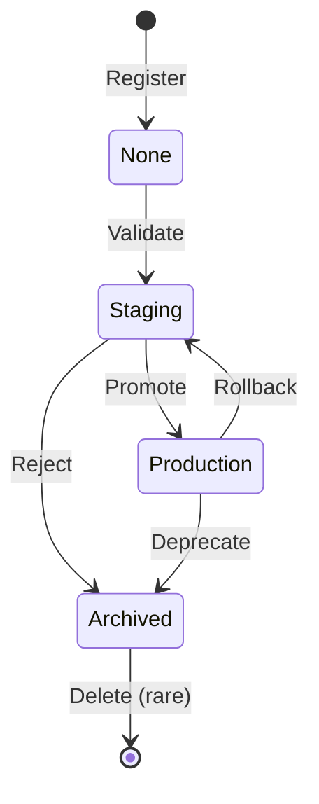

# Practice 1: Treat Names and Stages Like Product Contracts

## The Problem

```python
# ❌ Bad: Version numbers in names create dead ends
"fraud_detector_v1"
"fraud_detector_v2" 
"fraud_detector_final"
"fraud_detector_really_final"
"fraud_detector_oct_2024"
```

When you embed versions in names, you create a new "product" for each iteration. This leads to:
- Fragmented history
- Broken deployment scripts
- Confusion about which is "current"
- No clear migration path

## The Solution

```python
# ✅ Good: Product-centric names + registry-managed versions
"fraud_detector"      # version 1, 2, 3...
"search_ranker"       # version 1, 2, 3...
"recommendation_engine"
```

The **model name** represents the product/use case. The **version number** is managed by the registry.

## Naming Conventions



### Good Naming Patterns

```python
# Pattern: {domain}_{task}_{target}
"fraud_detection_binary"
"churn_prediction_multiclass"
"demand_forecasting_regression"

# Pattern: {product}_{component}
"recommendation_candidate_generation"
"recommendation_ranking"
"search_relevance_scorer"

# Pattern: {business_unit}_{use_case}
"payments_risk_model"
"lending_credit_score"
"marketing_propensity_model"
```

### Bad Naming Patterns (Avoid)

```python
# ❌ Includes version
"model_v2"
"fraud_model_2024"

# ❌ Includes algorithm (algorithms change)
"fraud_xgboost"
"churn_lstm"

# ❌ Too generic
"model"
"classifier"
"production_model"

# ❌ Includes date
"oct_2024_model"
"model_20241008"

# ❌ Includes person's name
"marias_model"
"johns_classifier"
```

## Stage Lifecycle

Define clear stage meanings that everyone understands:

```python
STAGES = {
    "None": "Just registered, not validated",
    "Staging": "Integration/acceptance testing",
    "Production": "Actively serving traffic",
    "Archived": "Retired but kept for audit/rollback"
}
```

### Stage Flow



### Stage Meanings

**None (No stage assigned)**
- Just registered from a training run
- Not yet validated
- Undergoing initial review
- Default state after registration

**Staging**
- Passed offline validation gates
- Undergoing integration testing
- Shadow deployment active
- Performance being monitored

**Production**
- Serving live traffic
- Passed all promotion gates
- Actively monitored
- SLA applies

**Archived**
- No longer serving traffic
- Kept for audit trail
- Available for emergency rollback
- Eventually deleted per retention policy

## Implementation

### Registration Pattern

```python
import mlflow
from mlflow.tracking import MlflowClient

client = MlflowClient()

def register_model(run_id: str, model_name: str, description: str):
    """Register model with stable name and clear description"""
    
    mv = client.create_model_version(
        name=model_name,  # Product-centric, stable name
        source=f"runs:/{run_id}/model",
        run_id=run_id,
        description=description  # What makes this version unique
    )
    
    print(f"✓ Registered {model_name} version {mv.version}")
    return mv

# Usage
run_id = "abc123def456"
mv = register_model(
    run_id=run_id,
    model_name="fraud_detector",  # Stable name
    description="XGBoost baseline with calibrated probabilities"
)
```

### Promotion Pattern

```python
def promote_to_staging(model_name: str, version: int):
    """Move to staging for integration testing"""
    
    client.transition_model_version_stage(
        name=model_name,
        version=version,
        stage="Staging",
        archive_existing_versions=False  # Keep old staging for comparison
    )
    
    print(f"✓ {model_name} v{version} → Staging")

def promote_to_production(
    model_name: str, 
    version: int,
    archive_current: bool = True
):
    """Move to production after validation"""
    
    client.transition_model_version_stage(
        name=model_name,
        version=version,
        stage="Production",
        archive_existing_versions=archive_current  # Archive old prod
    )
    
    print(f"✓ {model_name} v{version} → Production")
    
    # Tag for audit
    client.set_model_version_tag(
        model_name, 
        version, 
        "promoted_to_prod_at", 
        datetime.now().isoformat()
    )
```

### Complete Example

```python
from datetime import datetime
import mlflow
from mlflow.tracking import MlflowClient

class ModelRegistry:
    """Manage model registration and lifecycle"""
    
    def __init__(self):
        self.client = MlflowClient()
    
    def register_new_model(
        self,
        run_id: str,
        model_name: str,
        description: str,
        tags: dict = None
    ) -> int:
        """Register a new model version"""
        
        # Ensure model exists
        try:
            self.client.get_registered_model(model_name)
        except:
            self.client.create_registered_model(
                name=model_name,
                description=f"Production model for {model_name}"
            )
        
        # Create version
        mv = self.client.create_model_version(
            name=model_name,
            source=f"runs:/{run_id}/model",
            run_id=run_id,
            description=description
        )
        
        # Add tags
        if tags:
            for key, value in tags.items():
                self.client.set_model_version_tag(
                    model_name, mv.version, key, value
                )
        
        # Tag with registration time
        self.client.set_model_version_tag(
            model_name,
            mv.version,
            "registered_at",
            datetime.now().isoformat()
        )
        
        print(f"✓ Registered {model_name} v{mv.version}")
        return int(mv.version)
    
    def promote(
        self,
        model_name: str,
        version: int,
        to_stage: str,
        archive_existing: bool = False
    ):
        """Promote model to new stage"""
        
        # Validate stage
        valid_stages = ["Staging", "Production", "Archived"]
        if to_stage not in valid_stages:
            raise ValueError(f"Stage must be one of {valid_stages}")
        
        # Get current stage
        mv = self.client.get_model_version(model_name, version)
        from_stage = mv.current_stage
        
        # Transition
        self.client.transition_model_version_stage(
            name=model_name,
            version=version,
            stage=to_stage,
            archive_existing_versions=archive_existing
        )
        
        # Log transition
        self.client.set_model_version_tag(
            model_name,
            version,
            f"transitioned_to_{to_stage.lower()}_at",
            datetime.now().isoformat()
        )
        
        print(f"✓ {model_name} v{version}: {from_stage} → {to_stage}")

# Usage Example
registry = ModelRegistry()

# After training
run_id = "abc123"
version = registry.register_new_model(
    run_id=run_id,
    model_name="fraud_detector",
    description="Improved recall on account takeover fraud",
    tags={
        "team": "fraud",
        "owner": "@meera",
        "algorithm": "xgboost"
    }
)

# After offline validation
registry.promote(
    model_name="fraud_detector",
    version=version,
    to_stage="Staging"
)

# After staging validation
registry.promote(
    model_name="fraud_detector",
    version=version,
    to_stage="Production",
    archive_existing=True  # Archive old prod version
)
```

## Why This Ages Well

### Clean Registry UI
When you browse the registry 6 months later:
```
fraud_detector (12 versions)
├─ v12: Production
├─ v11: Archived
├─ v10: Archived
└─ ...

churn_predictor (8 versions)
├─ v8: Staging
├─ v7: Production
└─ ...
```

Not this chaos:
```
fraud_detector_v1
fraud_detector_v2
fraud_detector_final
fraud_detector_really_final
fraud_v3_xgboost
fraud_oct_2024
```

### Predictable APIs
```python
# Always works, always clear
model = mlflow.pyfunc.load_model("models:/fraud_detector/Production")
model = mlflow.pyfunc.load_model("models:/fraud_detector/42")

# Fragile and confusing
model = mlflow.pyfunc.load_model("models:/fraud_detector_v2_final/Production")
```

### Easy Automation
```python
# Works for any model
def deploy_production_model(model_name: str):
    model_uri = f"models:/{model_name}/Production"
    deploy_to_kubernetes(model_uri, namespace="production")

# Must be customized for each model name
def deploy_fraud_v2_final():
    deploy_to_kubernetes("models:/fraud_detector_v2_final/Production")
```

## Key Takeaways

✅ **DO**:
- Use product-centric names: `fraud_detector`, `churn_predictor`
- Let the registry manage version numbers
- Define clear stage meanings
- Keep stage transitions auditable
- Use tags for metadata

❌ **DON'T**:
- Put version numbers in names: `model_v2`
- Put dates in names: `model_oct_2024`
- Put algorithms in names: `fraud_xgboost`
- Use generic names: `model`, `classifier`
- Skip stage definitions

---

**Why it ages well**: Clean names + consistent stages keep your UI and APIs predictable as the portfolio grows from 5 to 500 models.

---

**Navigation**: [← Back to Index](README.md) | [Next: Model Signatures →](02-model-signatures.md)
