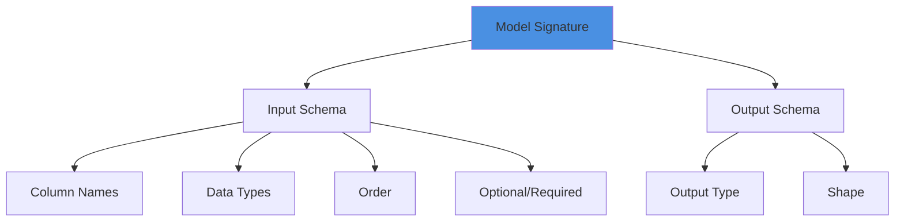

# Practice 2: Always Log Model Signatures and Enforce Them

## The Reality Check

> **Most production incidents are schema drift in disguise.**

A model expects 10 features in a specific order. Upstream changes add a new feature. The model receives 11 features, uses them in the wrong positions, and produces garbage predictions—silently.

## What is a Model Signature?



A signature captures:
- **Input**: Column names, types, order, constraints
- **Output**: Return type and shape
- **Optional**: Parameter schema for dynamic inputs

## Without Signatures (Fragile)

```python
# ❌ No signature = runtime surprises
model = mlflow.sklearn.load_model("models:/fraud_detector/Production")

# These all fail in different (bad) ways:
model.predict(df_with_extra_column)     # Extra column ignored or error
model.predict(df_with_missing_column)   # Error (if lucky)
model.predict(df_with_wrong_order)      # WRONG PREDICTIONS (silent!)
model.predict(df_with_wrong_types)      # Maybe works, maybe not
model.predict(df_with_renamed_column)   # Error or silent failure
```

The worst case: **Silent failure with wrong predictions.**

## With Signatures (Robust)

```python
# ✅ Signature enforced
import pandas as pd
import mlflow
from mlflow.models.signature import infer_signature

# Define expected schema with examples
X_sample = pd.DataFrame({
    "amount": [123.4, 456.7],
    "merchant_id": [42, 99],
    "country": ["US", "UK"],
    "hour": [9, 14],
    "day_of_week": [1, 5]
})
y_sample = [0, 1]

with mlflow.start_run() as run:
    # Train model
    model = train_fraud_model(X_train, y_train)
    
    # Infer and log signature
    signature = infer_signature(X_sample, model.predict(X_sample))
    
    mlflow.sklearn.log_model(
        sk_model=model,
        artifact_path="model",
        signature=signature,           # Lock in the schema
        input_example=X_sample[:1],    # Example for documentation
        pip_requirements=["scikit-learn==1.3.0", "pandas==2.0.0"]
    )
```

Now MLflow will raise a clear error if the input doesn't match:
```python
model = mlflow.pyfunc.load_model("models:/fraud_detector/Production")

# Wrong schema raises ValueError immediately
model.predict(df_with_wrong_columns)
# ValueError: Model expected columns: ['amount', 'merchant_id', 'country', 'hour', 'day_of_week']
# But received: ['amount', 'merchant_id', 'country_code', 'hour', 'day']
```

## Automatic Signature Inference

```python
from mlflow.models.signature import infer_signature
import pandas as pd
import numpy as np

# For pandas DataFrames
X_sample = pd.DataFrame({
    "feature_1": [1.0, 2.0],
    "feature_2": [3.0, 4.0]
})
y_sample = model.predict(X_sample)

signature = infer_signature(X_sample, y_sample)

# For numpy arrays
X_array = np.array([[1.0, 2.0], [3.0, 4.0]])
y_array = model.predict(X_array)

signature = infer_signature(X_array, y_array)

# For classification with probabilities
y_proba = model.predict_proba(X_sample)
signature = infer_signature(X_sample, y_proba)
```

## Manual Signature Definition

For more control over schema:

```python
from mlflow.models.signature import ModelSignature
from mlflow.types.schema import Schema, ColSpec

# Define input schema explicitly
input_schema = Schema([
    ColSpec("double", "amount"),
    ColSpec("long", "merchant_id"),
    ColSpec("string", "country"),
    ColSpec("long", "hour"),
    ColSpec("long", "day_of_week")
])

# Define output schema
output_schema = Schema([ColSpec("long")])  # Binary classification

# Create signature
signature = ModelSignature(
    inputs=input_schema,
    outputs=output_schema
)

# Log with manual signature
mlflow.sklearn.log_model(
    model,
    "model",
    signature=signature
)
```

### Supported Data Types

```python
from mlflow.types.schema import ColSpec

# Numeric types
ColSpec("double", "feature_name")   # Float
ColSpec("float", "feature_name")    # Float32
ColSpec("long", "feature_name")     # Integer
ColSpec("integer", "feature_name")  # Integer32

# String types
ColSpec("string", "feature_name")   # Text

# Boolean
ColSpec("boolean", "feature_name")  # True/False

# Binary
ColSpec("binary", "feature_name")   # Bytes

# Datetime
ColSpec("datetime", "feature_name") # Timestamps
```

## Validation at Inference

### Automatic Validation

```python
import mlflow.pyfunc

# MLflow automatically validates on load/predict
model = mlflow.pyfunc.load_model("models:/fraud_detector/Production")

# Validation happens here - raises ValueError if mismatch
predictions = model.predict(input_data)
```

### Custom Validation Wrapper

```python
import mlflow.pyfunc
from mlflow.exceptions import MlflowException

class ValidatedModel(mlflow.pyfunc.PythonModel):
    """Model wrapper with enhanced signature validation"""
    
    def load_context(self, context):
        self.model = mlflow.sklearn.load_model(context.artifacts["model"])
        # Signature is available in metadata
        self.signature = self.model.metadata.signature
    
    def predict(self, context, model_input):
        """Predict with detailed error messages"""
        
        try:
            # MLflow validates automatically
            predictions = self.model.predict(model_input)
            return predictions
            
        except MlflowException as e:
            # Enhanced error message
            if "schema" in str(e).lower():
                expected = self.signature.inputs.input_names()
                received = list(model_input.columns) if hasattr(model_input, 'columns') else "unknown"
                
                error_msg = f"""
Schema Validation Failed!

Expected columns: {expected}
Received columns: {received}

Missing: {set(expected) - set(received)}
Extra: {set(received) - set(expected)}

Please ensure your input matches the model signature.
                """
                print(error_msg)
            raise
```

## Signature Evolution

### Adding Optional Features

When you add features, handle backward compatibility:

```python
import pandas as pd

class BackwardCompatibleModel(mlflow.pyfunc.PythonModel):
    """Handle models with evolving schemas"""
    
    def load_context(self, context):
        self.model = mlflow.sklearn.load_model(context.artifacts["model"])
        self.required_features = [
            "amount", "merchant_id", "country", "hour", "day_of_week"
        ]
        self.optional_features = [
            "user_age",  # Added in v2
            "merchant_category"  # Added in v3
        ]
    
    def predict(self, context, model_input):
        """Handle both old and new schemas"""
        
        # Check required features
        missing = set(self.required_features) - set(model_input.columns)
        if missing:
            raise ValueError(f"Missing required features: {missing}")
        
        # Add optional features with defaults if missing
        for feature in self.optional_features:
            if feature not in model_input.columns:
                if feature == "user_age":
                    model_input[feature] = 30  # Default value
                elif feature == "merchant_category":
                    model_input[feature] = "UNKNOWN"
        
        # Ensure column order
        all_features = self.required_features + self.optional_features
        model_input = model_input[all_features]
        
        return self.model.predict(model_input)
```

### Breaking Schema Changes

When schemas change incompatibly:

```python
def migrate_to_new_schema(model_name: str, old_version: int, new_version: int):
    """
    Migrate from old schema to new schema
    
    Strategy:
    1. Deploy new version with new schema to separate endpoint
    2. Update upstream to provide new schema
    3. Shadow test for confidence
    4. Switch traffic to new version
    5. Deprecate old version
    """
    
    print(f"Migration plan for {model_name}")
    print(f"  Old: v{old_version} (current schema)")
    print(f"  New: v{new_version} (new schema)")
    print("\nSteps:")
    print("  1. Deploy v{new_version} to /v2 endpoint")
    print("  2. Update clients to send new schema")
    print("  3. Shadow test for 48h")
    print("  4. Switch /prod endpoint to v{new_version}")
    print("  5. Monitor for 24h")
    print("  6. Archive v{old_version}")
```

## Testing Signatures

```python
import pytest
import pandas as pd
import mlflow

def test_model_signature():
    """Test that model signature is correctly defined"""
    
    model_uri = "models:/fraud_detector/Staging"
    model = mlflow.pyfunc.load_model(model_uri)
    
    # Check signature exists
    assert model.metadata.signature is not None, "Model must have signature"
    
    # Check input schema
    expected_inputs = ["amount", "merchant_id", "country", "hour", "day_of_week"]
    actual_inputs = model.metadata.signature.inputs.input_names()
    assert actual_inputs == expected_inputs, f"Input schema mismatch: {actual_inputs}"
    
    # Check output schema
    assert model.metadata.signature.outputs is not None, "Must define output schema"

def test_signature_validation():
    """Test that signature validation works"""
    
    model = mlflow.pyfunc.load_model("models:/fraud_detector/Staging")
    
    # Valid input should work
    valid_input = pd.DataFrame({
        "amount": [100.0],
        "merchant_id": [42],
        "country": ["US"],
        "hour": [9],
        "day_of_week": [1]
    })
    predictions = model.predict(valid_input)
    assert predictions is not None
    
    # Invalid input should fail
    invalid_input = pd.DataFrame({
        "amount": [100.0],
        "merchant_id": [42]
        # Missing required columns
    })
    
    with pytest.raises(Exception) as exc_info:
        model.predict(invalid_input)
    
    assert "schema" in str(exc_info.value).lower()
```

## Common Pitfalls

### 1. Logging Model Without Signature
```python
# ❌ Don't do this
mlflow.sklearn.log_model(model, "model")  # No signature!

# ✅ Always include signature
signature = infer_signature(X_train, model.predict(X_train))
mlflow.sklearn.log_model(model, "model", signature=signature)
```

### 2. Using Training Data for Signature
```python
# ⚠️ Risky: training data might have extra columns
signature = infer_signature(X_train_full, y_train)

# ✅ Better: use only features the model actually needs
X_model_input = X_train[model.feature_names_in_]
signature = infer_signature(X_model_input, model.predict(X_model_input))
```

### 3. Ignoring Column Order
```python
# ❌ Different column order = different predictions!
X_wrong_order = X_test[['merchant_id', 'amount', 'country', 'hour', 'day_of_week']]

# ✅ Signature enforces correct order
# MLflow will reorder columns to match signature automatically
```

## Key Takeaways

✅ **DO**:
- Always log signatures with `infer_signature()`
- Include `input_example` for documentation
- Test signature validation in CI/CD
- Use manual signatures for complex schemas
- Version signatures when schema evolves

❌ **DON'T**:
- Skip signatures ("I'll add it later")
- Assume column order doesn't matter
- Ignore signature validation errors
- Make breaking schema changes without migration plan

---

**Why it ages well**: Strong typing for ML I/O reduces brittle glue code and keeps downstream feature pipelines honest. Catches 80% of production issues before they happen.

---

**Navigation**: [← Previous: Names and Stages](01-names-and-stages.md) | [Back to Index](README.md) | [Next: Promotion Gates →](03-promotion-gates.md)
