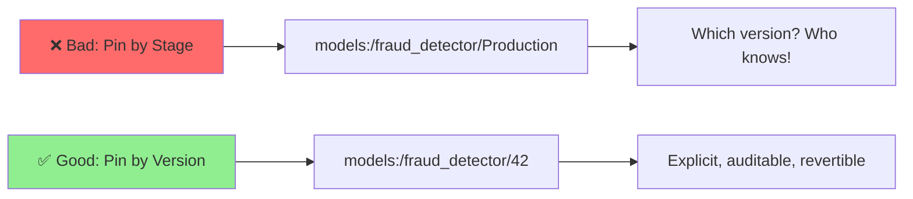

# Practice 4: Keep Rollbacks Boring

## The Goal
> At 2 AM, you should revert with a single config change — not a scavenger hunt.

## Pin by Version, Not Stage



## Version Pinning Strategy

```python
# config/model_versions.yaml
models:
  fraud_detector:
    current: 42
    previous: 41
    fallback: 40
```

## Kubernetes ConfigMap Pattern

```yaml
apiVersion: v1
kind: ConfigMap
metadata:
  name: model-versions
data:
  fraud_detector: "42"
```

```bash
# Rollback is one command
kubectl patch configmap model-versions -p '{"data":{"fraud_detector":"41"}}'
kubectl rollout restart deployment/fraud-detector
```

## Key Patterns

1. **Always pin by version number** in deployment configs
2. **Keep N-2 versions warm** for fast rollback
3. **One command rollback** - no investigation needed
4. **Test rollback procedure** regularly (chaos engineering)

See [Full Guide](FULL_GUIDE.md#practice-4-keep-rollbacks-boring) for:
- Complete deployment configuration code
- Rollback automation scripts
- Kubernetes examples
- Warm standby patterns

---

**Navigation**: [← Previous: Promotion Gates](03-promotion-gates.md) | [Back to Index](README.md) | [Next: Complete Logging →](05-complete-logging.md)
