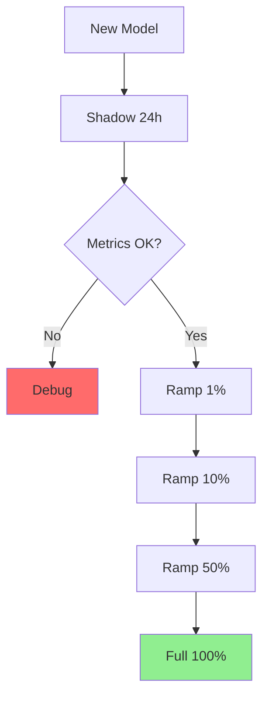

# Practice 7: Shadow First, Then Ramp

## Traffic Control Strategy



## Shadow Mode

```python
# Candidate predicts but doesn't serve
champion_pred = champion.predict(x)  # Real decision
candidate_pred = candidate.predict(x)  # Log only

log_comparison(champion_pred, candidate_pred)

return champion_pred  # Champion still serves
```

## Ramp Mode

```python
# Gradually increase candidate traffic
if random() < ramp_percentage:  # e.g., 0.10 for 10%
    return candidate.predict(x)
else:
    return champion.predict(x)
```

## Automated Ramp Controller

```python
class RampController:
    def __init__(self, stages=[0.01, 0.05, 0.10, 0.25, 0.50, 1.0]):
        self.stages = stages
        self.guardrails = {
            "max_error_rate": 0.01,
            "max_latency_p99": 100,
            "min_agreement_rate": 0.85
        }
    
    def start_ramp(self):
        for pct in self.stages:
            deploy_at_percentage(pct)
            if not self._health_check():
                self._rollback()
                return False
        return True
```

## Guardrails for Auto-Rollback

- Error rate > 1%
- P99 latency > 100ms
- Agreement with shadow < 85%
- Any SLA breach

See [Full Guide](FULL_GUIDE.md#practice-7-shadow-first-then-ramp) for complete implementation.

---

**Why it ages well**: Institutionalize caution without slowing shipping. Scales to hundreds of services.

---

**Navigation**: [← Previous: Model/Policy Separation](06-model-policy-separation.md) | [Back to Index](README.md) | [Full Detailed Guide](FULL_GUIDE.md)
