# MLflow Best Practices: Production-Ready Model Registry

## Overview
These battle-tested practices help ML platforms remain maintainable and reliable over time. They're based on real-world experience managing model registries at scale.

> **Key Insight**: Shipping a model is easy. Living with it for two years is the hard part.

## The Challenge

```mermaid
graph TB
    A[Model Registry Over Time] --> B[6 months]
    A --> C[1 year]
    A --> D[2 years]
    
    B --> B1[🟢 Clean & Organized]
    C --> C1[🟡 Getting Messy]
    D --> D1[🔴 Junk Drawer]
    
    style B1 fill:#90EE90
    style C1 fill:#FFD700
    style D1 fill:#FF6B6B
```



Without consistent practices, your registry becomes unmaintainable. These seven practices prevent that.

---

## Practice 1: Treat Names and Stages Like Product Contracts

### The Problem
```python
# ❌ Bad: Version numbers in names create dead ends
"fraud_detector_v1"
"fraud_detector_v2" 
"fraud_detector_final"
"fraud_detector_really_final"
"fraud_detector_oct_2024"
```

### The Solution
```python
# ✅ Good: Product-centric names + registry-managed versions
"fraud_detector"      # version 1, 2, 3...
"search_ranker"       # version 1, 2, 3...
"recommendation_engine"
```

### Naming Conventions

```mermaid
graph LR
    A[Model Name] --> B[Use Case]
    B --> C[fraud_detector]
    B --> D[churn_predictor]
    B --> E[demand_forecaster]
    
    F[NOT Model Name] -.->|❌| G[fraud_detector_v2]
    F -.->|❌| H[model_oct_2024]
    F -.->|❌| I[final_model]
    
    style A fill:#4A90E2
    style F fill:#FF6B6B
```



### Stage Lifecycle

```python
# Define clear stage meanings
STAGES = {
    "None": "Just registered, not validated",
    "Staging": "Integration/acceptance testing",
    "Production": "Actively serving traffic",
    "Archived": "Retired but kept for audit/rollback"
}
```

### Implementation

```python
import mlflow
from mlflow.tracking import MlflowClient

client = MlflowClient()

# Good registration pattern
def register_model(run_id: str, model_name: str, description: str):
    """Register model with stable name and clear description"""
    
    mv = client.create_model_version(
        name=model_name,  # Product-centric, stable name
        source=f"runs:/{run_id}/model",
        run_id=run_id,
        description=description  # What makes this version unique
    )
    
    print(f"✓ Registered {model_name} version {mv.version}")
    return mv

# Promote with purpose
def promote_to_staging(model_name: str, version: int):
    """Move to staging for integration testing"""
    
    client.transition_model_version_stage(
        name=model_name,
        version=version,
        stage="Staging",
        archive_existing_versions=False  # Keep old staging for comparison
    )
    
    print(f"✓ {model_name} v{version} → Staging")

# Usage
run_id = "abc123def456"
mv = register_model(
    run_id=run_id,
    model_name="fraud_detector",
    description="XGBoost baseline with calibrated probabilities"
)

# After validation
promote_to_staging("fraud_detector", mv.version)
```

**Why it ages well**: Clean names and consistent stages keep your UI and APIs predictable as the portfolio grows from 5 to 500 models.

---

## Practice 2: Always Log Model Signatures and Enforce Them

### The Reality Check
> Most production incidents are schema drift in disguise.

### What is a Model Signature?


### Without Signatures (Fragile)

```python
# ❌ No signature = runtime surprises
model = mlflow.sklearn.load_model("models:/fraud_detector/Production")

# These all silently fail in different ways:
model.predict(df_with_extra_column)     # Ignored
model.predict(df_with_missing_column)   # Error
model.predict(df_with_wrong_order)      # Wrong predictions!
model.predict(df_with_wrong_types)      # Maybe works, maybe not
```

### With Signatures (Robust)

```python
import pandas as pd
import mlflow
from mlflow.models.signature import infer_signature

# Define expected schema
X_sample = pd.DataFrame({
    "amount": [123.4, 456.7],
    "merchant_id": [42, 99],
    "country": ["US", "UK"],
    "hour": [9, 14],
    "day_of_week": [1, 5]
})
y_sample = [0, 1]

with mlflow.start_run() as run:
    # Train model
    model = train_fraud_model(X_train, y_train)
    
    # Infer and log signature
    signature = infer_signature(X_sample, model.predict(X_sample))
    
    mlflow.sklearn.log_model(
        sk_model=model,
        artifact_path="model",
        signature=signature,           # Lock in the schema
        input_example=X_sample[:1],    # Example for documentation
        pip_requirements=["scikit-learn==1.3.0", "pandas==2.0.0"]
    )
```

### Manual Signature Definition

```python
from mlflow.models.signature import ModelSignature
from mlflow.types.schema import Schema, ColSpec

# For more control
input_schema = Schema([
    ColSpec("double", "amount"),
    ColSpec("long", "merchant_id"),
    ColSpec("string", "country"),
    ColSpec("long", "hour"),
    ColSpec("long", "day_of_week")
])

output_schema = Schema([ColSpec("long")])

signature = ModelSignature(
    inputs=input_schema,
    outputs=output_schema
)
```

### Signature Validation at Inference

```python
import mlflow.pyfunc

class ValidatedModel(mlflow.pyfunc.PythonModel):
    """Model wrapper with strict signature validation"""
    
    def load_context(self, context):
        self.model = mlflow.sklearn.load_model(context.artifacts["model"])
    
    def predict(self, context, model_input):
        # Signature validation happens automatically
        # MLflow will raise ValueError if schema doesn't match
        
        try:
            return self.model.predict(model_input)
        except Exception as e:
            # Log schema violations
            print(f"Schema violation: {e}")
            print(f"Expected: {self.model.metadata.signature}")
            print(f"Received columns: {model_input.columns.tolist()}")
            raise
```

**Why it ages well**: Strong typing for ML I/O reduces brittle glue code and keeps downstream feature pipelines honest.

---

## Practice 3: Promote with Gates, Not Vibes

### The Problem
```
❌ "I'm pretty sure this model is better, let's deploy it"
❌ "The metrics look good to me"
❌ "YOLO ship it"
```

### The Solution: CI/CD Gates


### Implementation

```python
# promotion_gates.py
from mlflow.tracking import MlflowClient
from typing import Dict, List
import pandas as pd

class PromotionGates:
    """Automated gates for model promotion"""
    
    def __init__(self, client: MlflowClient):
        self.client = client
    
    def check_offline_gates(
        self,
        candidate_version: int,
        champion_version: int,
        model_name: str
    ) -> Dict[str, bool]:
        """
        Offline quality gates before staging
        
        Gates:
        - Performance: accuracy/AUC within threshold of champion
        - Fairness: demographic parity difference < 0.1
        - Robustness: performance on test slices
        """
        
        candidate_metrics = self._get_metrics(model_name, candidate_version)
        champion_metrics = self._get_metrics(model_name, champion_version)
        
        gates = {
            "accuracy_threshold": (
                candidate_metrics["accuracy"] >= 
                champion_metrics["accuracy"] - 0.02  # 2% tolerance
            ),
            "auc_threshold": (
                candidate_metrics["auc"] >= 
                champion_metrics["auc"] - 0.01
            ),
            "fairness_check": (
                candidate_metrics.get("demographic_parity", 0) <= 0.1
            ),
            "calibration_check": (
                candidate_metrics.get("calibration_psi", 1.0) <= 0.1
            )
        }
        
        return gates
    
    def check_staging_gates(
        self,
        model_name: str,
        version: int,
        staging_metrics: Dict[str, float]
    ) -> Dict[str, bool]:
        """
        Online gates in staging environment
        
        Gates:
        - Latency: P95 < 25ms, P99 < 50ms
        - Memory: < 1GB per replica
        - Cold start: < 2 seconds
        - Error rate: < 0.1%
        """
        
        gates = {
            "latency_p95": staging_metrics.get("p95_latency_ms", 1000) <= 25,
            "latency_p99": staging_metrics.get("p99_latency_ms", 1000) <= 50,
            "memory_usage": staging_metrics.get("memory_mb", 2000) <= 1024,
            "cold_start": staging_metrics.get("cold_start_sec", 10) <= 2,
            "error_rate": staging_metrics.get("error_rate", 1.0) <= 0.001,
            "logging_complete": staging_metrics.get("logs_captured", False)
        }
        
        return gates
    
    def check_production_gates(
        self,
        ab_test_results: Dict[str, float]
    ) -> Dict[str, bool]:
        """
        Final gates before production rollout
        
        Gates:
        - Business metrics improvement
        - No SLA violations
        - Successful shadow period
        """
        
        gates = {
            "business_metric_lift": ab_test_results.get("lift", 0) >= 0,
            "no_sla_violations": ab_test_results.get("sla_violations", 1) == 0,
            "shadow_success": ab_test_results.get("shadow_days", 0) >= 3,
            "statistical_significance": ab_test_results.get("p_value", 1.0) <= 0.05
        }
        
        return gates
    
    def promote_if_passed(
        self,
        model_name: str,
        candidate_version: int,
        champion_version: int,
        target_stage: str
    ) -> bool:
        """Promote only if all gates pass"""
        
        # Check appropriate gates
        if target_stage == "Staging":
            gates = self.check_offline_gates(
                candidate_version, champion_version, model_name
            )
        elif target_stage == "Production":
            # Assume staging metrics collected
            staging_metrics = self._collect_staging_metrics(model_name, candidate_version)
            gates = self.check_staging_gates(model_name, candidate_version, staging_metrics)
        else:
            raise ValueError(f"Unknown stage: {target_stage}")
        
        # All gates must pass
        all_passed = all(gates.values())
        
        if all_passed:
            self.client.transition_model_version_stage(
                name=model_name,
                version=candidate_version,
                stage=target_stage,
                archive_existing_versions=False
            )
            print(f"✅ {model_name} v{candidate_version} → {target_stage}")
            print(f"   Gates: {gates}")
        else:
            failed = [k for k, v in gates.items() if not v]
            print(f"❌ Promotion blocked. Failed gates: {failed}")
        
        return all_passed
    
    def _get_metrics(self, model_name: str, version: int) -> Dict[str, float]:
        """Get metrics for a model version"""
        mv = self.client.get_model_version(model_name, version)
        run = self.client.get_run(mv.run_id)
        return run.data.metrics
    
    def _collect_staging_metrics(self, model_name: str, version: int) -> Dict[str, float]:
        """Collect metrics from staging deployment"""
        # Implementation depends on your monitoring setup
        # This would query Prometheus, for example
        return {
            "p95_latency_ms": 18.5,
            "p99_latency_ms": 45.2,
            "memory_mb": 512,
            "cold_start_sec": 1.2,
            "error_rate": 0.0001,
            "logs_captured": True
        }

# Usage
client = MlflowClient()
gates = PromotionGates(client)

# Promote to staging
passed = gates.promote_if_passed(
    model_name="fraud_detector",
    candidate_version=42,
    champion_version=40,
    target_stage="Staging"
)
```

### CI/CD Integration

```yaml
# .github/workflows/model-promotion.yaml
name: Model Promotion with Gates

on:
  workflow_dispatch:
    inputs:
      model_name:
        required: true
      candidate_version:
        required: true
      target_stage:
        required: true
        type: choice
        options: [Staging, Production]

jobs:
  promote:
    runs-on: ubuntu-latest
    steps:
      - uses: actions/checkout@v3
      
      - name: Run promotion gates
        env:
          MLFLOW_TRACKING_URI: ${{ secrets.MLFLOW_TRACKING_URI }}
        run: |
          python scripts/promotion_gates.py \
            --model-name ${{ inputs.model_name }} \
            --candidate-version ${{ inputs.candidate_version }} \
            --target-stage ${{ inputs.target_stage }}
      
      - name: Notify on success
        if: success()
        run: |
          echo "✅ Promotion successful"
          # Send Slack notification
      
      - name: Notify on failure
        if: failure()
        run: |
          echo "❌ Promotion blocked by gates"
          # Send Slack notification with failed gates
```

**Why it ages well**: New teammates can ship with confidence because the gates don't forget edge cases.

---

## Practice 4: Keep Rollbacks Boring

### The Goal
> At 2 AM, you should revert with a single config change — not a scavenger hunt.

### Pin by Version, Not Stage

```mermaid
graph LR
    A[❌ Bad: Pin by Stage] --> B["models:/fraud_detector/Production"]
    B --> C[Which version? Who knows!]
    
    D[✅ Good: Pin by Version] --> E["models:/fraud_detector/42"]
    E --> F[Explicit, auditable, revertible]
    
    style A fill:#FF6B6B
    style D fill:#90EE90
```



### Version Pinning Strategy

```python
# config/model_versions.yaml
models:
  fraud_detector:
    current: 42
    previous: 41
    fallback: 40
    
  churn_predictor:
    current: 15
    previous: 14
    fallback: 13
```

### Deployment Configuration

```python
# deployment_config.py
import yaml
from dataclasses import dataclass
from typing import Dict

@dataclass
class ModelDeploymentConfig:
    """Track deployed model versions"""
    model_name: str
    current_version: int
    previous_version: int
    fallback_version: int
    
    @classmethod
    def load(cls, path: str = "config/model_versions.yaml") -> Dict[str, 'ModelDeploymentConfig']:
        with open(path) as f:
            data = yaml.safe_load(f)
        
        return {
            name: cls(
                model_name=name,
                current_version=versions['current'],
                previous_version=versions['previous'],
                fallback_version=versions['fallback']
            )
            for name, versions in data['models'].items()
        }
    
    def save(self, path: str = "config/model_versions.yaml"):
        """Save configuration"""
        # Implementation
        pass

# Serve with pinned version
def load_production_model(model_name: str):
    """Load model by pinned version, not stage"""
    
    config = ModelDeploymentConfig.load()
    model_config = config[model_name]
    
    # Explicit version pinning
    model_uri = f"models:/{model_name}/{model_config.current_version}"
    
    print(f"Loading {model_name} v{model_config.current_version}")
    print(f"  Rollback available: v{model_config.previous_version}")
    
    return mlflow.pyfunc.load_model(model_uri)
```

### Rollback Procedure

```python
# rollback.py
import argparse
from deployment_config import ModelDeploymentConfig

def rollback_model(model_name: str, target: str = "previous"):
    """
    Rollback to previous or fallback version
    
    Args:
        model_name: Name of model to rollback
        target: "previous" or "fallback"
    """
    
    config = ModelDeploymentConfig.load()
    model_config = config[model_name]
    
    if target == "previous":
        new_version = model_config.previous_version
    elif target == "fallback":
        new_version = model_config.fallback_version
    else:
        raise ValueError(f"Unknown target: {target}")
    
    print(f"🔄 Rolling back {model_name}")
    print(f"   Current: v{model_config.current_version}")
    print(f"   Target:  v{new_version}")
    
    # Update configuration
    model_config.fallback_version = model_config.previous_version
    model_config.previous_version = model_config.current_version
    model_config.current_version = new_version
    model_config.save()
    
    # Trigger deployment
    deploy_model(model_name, new_version)
    
    print(f"✅ Rollback complete")

# CLI
if __name__ == "__main__":
    parser = argparse.ArgumentParser()
    parser.add_argument("--model-name", required=True)
    parser.add_argument("--target", choices=["previous", "fallback"], default="previous")
    args = parser.parse_args()
    
    rollback_model(args.model_name, args.target)
```

### Kubernetes ConfigMap Pattern

```yaml
# model-versions-configmap.yaml
apiVersion: v1
kind: ConfigMap
metadata:
  name: model-versions
  namespace: default
data:
  fraud_detector: "42"
  churn_predictor: "15"
  recommendation_engine: "8"
```

```yaml
# model-deployment.yaml
apiVersion: apps/v1
kind: Deployment
metadata:
  name: fraud-detector
spec:
  template:
    spec:
      containers:
      - name: model-server
        image: mlflow-server:latest
        env:
        - name: MODEL_NAME
          value: "fraud_detector"
        - name: MODEL_VERSION
          valueFrom:
            configMapKeyRef:
              name: model-versions
              key: fraud_detector
        command:
        - mlflow
        - models
        - serve
        - -m
        - "models:/$(MODEL_NAME)/$(MODEL_VERSION)"
```

```bash
# Rollback is a single kubectl command
kubectl patch configmap model-versions \
  -p '{"data":{"fraud_detector":"41"}}'

# Rollout restart to pick up new version
kubectl rollout restart deployment/fraud-detector
```

### Keep N-2 Warm

```python
# warm_standby.py
from mlflow.tracking import MlflowClient

def keep_warm_standbys(model_name: str, keep_count: int = 3):
    """Keep recent production versions warm for fast rollback"""
    
    client = MlflowClient()
    
    # Get production versions
    prod_versions = client.get_latest_versions(model_name, stages=["Production"])
    
    # Get archived versions that were recently in production
    all_versions = client.search_model_versions(f"name='{model_name}'")
    recent_archived = [
        v for v in all_versions
        if v.current_stage == "Archived"
        and "was_production" in v.tags
    ][:keep_count-1]
    
    warm_versions = prod_versions + recent_archived
    
    print(f"Keeping warm: {[v.version for v in warm_versions]}")
    
    return warm_versions
```

**Why it ages well**: When incidents happen, you revert with one command, not emergency debugging.

---

## Practice 5: Log the Full Story

### What to Log


### Implementation

```python
# comprehensive_logging.py
import mlflow
import json
from datetime import datetime
from typing import Dict, Any
import matplotlib.pyplot as plt
import shap

class ComprehensiveLogger:
    """Log everything needed to reproduce and audit a model"""
    
    def __init__(self, run_name: str = None):
        self.run_name = run_name or f"training-{datetime.now().isoformat()}"
    
    def log_complete_model(
        self,
        model,
        X_train,
        y_train,
        X_test,
        y_test,
        lineage: Dict[str, Any],
        decision_context: Dict[str, str]
    ):
        """Log model with complete context"""
        
        with mlflow.start_run(run_name=self.run_name) as run:
            # 1. Log lineage
            self._log_lineage(lineage)
            
            # 2. Log hyperparameters
            self._log_hyperparameters(model)
            
            # 3. Log metrics
            self._log_metrics(model, X_test, y_test)
            
            # 4. Log artifacts
            self._log_artifacts(model, X_train, y_train, X_test, y_test)
            
            # 5. Log decision context
            self._log_decision_context(decision_context)
            
            # 6. Log model with signature
            from mlflow.models.signature import infer_signature
            signature = infer_signature(X_train, model.predict(X_train))
            
            mlflow.sklearn.log_model(
                model,
                "model",
                signature=signature,
                input_example=X_train[:5]
            )
            
            return run.info.run_id
    
    def _log_lineage(self, lineage: Dict[str, Any]):
        """Log complete data and code lineage"""
        
        mlflow.set_tags({
            "git_commit": lineage.get("git_commit", "unknown"),
            "git_branch": lineage.get("git_branch", "unknown"),
            "dataset_commit": lineage.get("dataset_commit", "unknown"),
            "code_version": lineage.get("code_version", "unknown")
        })
        
        mlflow.log_params({
            "feature_store_txn_view": lineage.get("feature_views", {}).get("txn", "unknown"),
            "feature_store_geo_view": lineage.get("feature_views", {}).get("geo", "unknown"),
            "training_dataset_path": lineage.get("dataset_path", "unknown"),
            "preprocessing_version": lineage.get("preprocessing_version", "unknown")
        })
        
        # Save full lineage as JSON
        mlflow.log_dict(lineage, "lineage.json")
    
    def _log_hyperparameters(self, model):
        """Log all model hyperparameters"""
        
        if hasattr(model, 'get_params'):
            params = model.get_params()
            mlflow.log_params(params)
    
    def _log_metrics(self, model, X_test, y_test):
        """Log comprehensive evaluation metrics"""
        
        from sklearn.metrics import (
            accuracy_score, precision_score, recall_score,
            f1_score, roc_auc_score, log_loss
        )
        
        y_pred = model.predict(X_test)
        y_pred_proba = model.predict_proba(X_test)
        
        metrics = {
            "accuracy": accuracy_score(y_test, y_pred),
            "precision": precision_score(y_test, y_pred, average='weighted'),
            "recall": recall_score(y_test, y_pred, average='weighted'),
            "f1": f1_score(y_test, y_pred, average='weighted'),
            "roc_auc": roc_auc_score(y_test, y_pred_proba, multi_class='ovr', average='weighted'),
            "log_loss": log_loss(y_test, y_pred_proba)
        }
        
        mlflow.log_metrics(metrics)
    
    def _log_artifacts(self, model, X_train, y_train, X_test, y_test):
        """Log visual and analytical artifacts"""
        
        # Feature importance
        if hasattr(model, 'feature_importances_'):
            import pandas as pd
            importance_df = pd.DataFrame({
                'feature': X_train.columns,
                'importance': model.feature_importances_
            }).sort_values('importance', ascending=False)
            
            fig, ax = plt.subplots(figsize=(10, 6))
            ax.barh(importance_df['feature'][:15], importance_df['importance'][:15])
            ax.set_xlabel('Importance')
            ax.set_title('Top 15 Feature Importances')
            plt.tight_layout()
            mlflow.log_figure(fig, "feature_importance.png")
            plt.close()
            
            importance_df.to_csv("feature_importance.csv", index=False)
            mlflow.log_artifact("feature_importance.csv")
        
        # Confusion matrix
        from sklearn.metrics import confusion_matrix
        import seaborn as sns
        
        y_pred = model.predict(X_test)
        cm = confusion_matrix(y_test, y_pred)
        
        fig, ax = plt.subplots(figsize=(8, 6))
        sns.heatmap(cm, annot=True, fmt='d', cmap='Blues', ax=ax)
        ax.set_xlabel('Predicted')
        ax.set_ylabel('Actual')
        ax.set_title('Confusion Matrix')
        mlflow.log_figure(fig, "confusion_matrix.png")
        plt.close()
        
        # SHAP values (for tree-based models)
        if hasattr(model, 'feature_importances_'):
            try:
                explainer = shap.TreeExplainer(model)
                shap_values = explainer.shap_values(X_test[:100])
                
                fig = plt.figure()
                shap.summary_plot(shap_values, X_test[:100], show=False)
                mlflow.log_figure(fig, "shap_summary.png")
                plt.close()
            except Exception as e:
                print(f"SHAP logging failed: {e}")
    
    def _log_decision_context(self, context: Dict[str, str]):
        """Log human decision context"""
        
        decision_doc = {
            "timestamp": datetime.now().isoformat(),
            "reason_for_training": context.get("reason", "Scheduled retraining"),
            "expected_improvements": context.get("improvements", "None specified"),
            "risks_identified": context.get("risks", "None identified"),
            "approver": context.get("approver", "unknown"),
            "business_context": context.get("business_context", ""),
            "deployment_plan": context.get("deployment_plan", "Standard rollout")
        }
        
        mlflow.log_dict(decision_doc, "decision_context.json")
        mlflow.set_tags({
            "approver": decision_doc["approver"],
            "deployment_plan": decision_doc["deployment_plan"]
        })

# Usage
logger = ComprehensiveLogger()

lineage = {
    "git_commit": "ab12cd3ef45",
    "git_branch": "main",
    "dataset_commit": "data-v2.1.0",
    "code_version": "1.5.0",
    "feature_views": {
        "txn": "v5",
        "geo": "v3"
    },
    "dataset_path": "s3://data/training/2024-10-01",
    "preprocessing_version": "v2.0"
}

decision_context = {
    "reason": "Improved recall on fraud type 'account_takeover'",
    "improvements": "Expected +3% recall, stable precision",
    "risks": "Slight increase in false positives for low-value transactions",
    "approver": "@meera",
    "business_context": "Q4 fraud spike mitigation",
    "deployment_plan": "Canary 10% for 48h, then full rollout"
}

run_id = logger.log_complete_model(
    model=trained_model,
    X_train=X_train,
    y_train=y_train,
    X_test=X_test,
    y_test=y_test,
    lineage=lineage,
    decision_context=decision_context
)
```

**Why it ages well**: Months later, you can reproduce (or legally defend) what shipped and why.

---

## Practice 6: Separate Model from Policy

### The Anti-Pattern

```python
# ❌ DON'T: Hard-code business logic in the model
class FraudModel:
    def predict(self, transaction):
        proba = self.model.predict_proba(transaction)[0, 1]
        
        # Business rules baked into model code
        if proba > 0.7:  # Threshold hard-coded
            return "block"
        elif transaction['amount'] > 10000:  # Another rule
            return "manual_review"
        else:
            return "allow"
```

**Problems**:
- Need to retrain/redeploy to change threshold
- Can't A/B test thresholds
- No audit trail for policy changes
- Compliance nightmare

### The Solution: External Policy Configuration


### Policy Configuration

```yaml
# config/fraud_policy.yaml
fraud_detector:
  version: "2.1"
  updated: "2024-10-08T10:30:00Z"
  updated_by: "@meera"
  
  # Decision thresholds
  thresholds:
    block: 0.7
    manual_review: 0.4
    allow: 0.0
  
  # Business rules
  rules:
    high_value_threshold: 10000
    high_value_action: "manual_review"
    new_merchant_lookback_days: 30
    new_merchant_action: "extra_verification"
  
  # Feature flags
  flags:
    enable_geo_blocking: true
    enable_velocity_checks: true
    strict_mode_countries: ["NG", "PK"]
  
  # Guardrails
  guardrails:
    max_daily_blocks_per_customer: 3
    auto_unblock_after_hours: 24
```

### Model + Policy Server

```python
# model_with_policy.py
import mlflow.pyfunc
import yaml
from typing import Dict, Any
from datetime import datetime

class PolicyAwareModel(mlflow.pyfunc.PythonModel):
    """Model that loads policy configuration separately"""
    
    def load_context(self, context):
        # Load model
        self.model = mlflow.sklearn.load_model(context.artifacts["model"])
        
        # Load initial policy (can be refreshed without restart)
        self.policy = self._load_policy()
        self.policy_last_loaded = datetime.now()
    
    def _load_policy(self, path: str = "config/fraud_policy.yaml") -> Dict:
        """Load policy configuration"""
        with open(path) as f:
            return yaml.safe_load(f)
    
    def _maybe_refresh_policy(self):
        """Refresh policy if stale (e.g., every 5 minutes)"""
        seconds_since_load = (datetime.now() - self.policy_last_loaded).seconds
        
        if seconds_since_load > 300:  # 5 minutes
            self.policy = self._load_policy()
            self.policy_last_loaded = datetime.now()
            print(f"Policy refreshed: v{self.policy['fraud_detector']['version']}")
    
    def predict(self, context, model_input, params: Dict[str, Any] = None):
        """
        Predict with policy application
        
        Returns: decisions with explainability
        """
        self._maybe_refresh_policy()
        
        # Get model prediction
        probabilities = self.model.predict_proba(model_input)[:, 1]
        
        # Apply policy
        decisions = []
        policy_config = self.policy['fraud_detector']
        
        for i, proba in enumerate(probabilities):
            transaction = model_input.iloc[i]
            decision = self._apply_policy(proba, transaction, policy_config)
            decisions.append(decision)
        
        return decisions
    
    def _apply_policy(
        self,
        probability: float,
        transaction: pd.Series,
        policy: Dict
    ) -> Dict[str, Any]:
        """Apply policy rules to model output"""
        
        thresholds = policy['thresholds']
        rules = policy['rules']
        flags = policy['flags']
        
        # Base decision from model
        if probability >= thresholds['block']:
            action = "block"
            reason = "high_fraud_probability"
        elif probability >= thresholds['manual_review']:
            action = "manual_review"
            reason = "moderate_fraud_probability"
        else:
            action = "allow"
            reason = "low_fraud_probability"
        
        # Apply business rules
        if transaction['amount'] > rules['high_value_threshold']:
            action = rules['high_value_action']
            reason = f"{reason}+high_value_transaction"
        
        # Apply feature flags
        if flags['enable_geo_blocking']:
            if transaction['country'] in flags['strict_mode_countries']:
                if action == "allow":
                    action = "manual_review"
                reason = f"{reason}+strict_mode_country"
        
        return {
            "action": action,
            "probability": float(probability),
            "reason": reason,
            "policy_version": policy['version'],
            "timestamp": datetime.now().isoformat()
        }

# Log model with policy support
with mlflow.start_run():
    policy_model = PolicyAwareModel()
    
    mlflow.pyfunc.log_model(
        artifact_path="model_with_policy",
        python_model=policy_model,
        artifacts={"model": "path/to/trained/model"}
    )
```

### Dynamic Policy Updates

```python
# policy_manager.py
from typing import Dict
import yaml

class PolicyManager:
    """Manage and version policy configurations"""
    
    def __init__(self, model_name: str):
        self.model_name = model_name
        self.policy_path = f"config/{model_name}_policy.yaml"
    
    def update_threshold(self, threshold_name: str, new_value: float):
        """Update a threshold without redeploying model"""
        
        policy = self._load_policy()
        old_value = policy[self.model_name]['thresholds'][threshold_name]
        
        policy[self.model_name]['thresholds'][threshold_name] = new_value
        policy[self.model_name]['updated'] = datetime.now().isoformat()
        
        self._save_policy(policy)
        
        # Log to MLflow for audit
        with mlflow.start_run(run_name=f"policy_update_{self.model_name}"):
            mlflow.log_param("policy_update_type", "threshold")
            mlflow.log_param("threshold_name", threshold_name)
            mlflow.log_param("old_value", old_value)
            mlflow.log_param("new_value", new_value)
            mlflow.set_tag("model_name", self.model_name)
        
        print(f"✓ Updated {threshold_name}: {old_value} → {new_value}")
    
    def _load_policy(self) -> Dict:
        with open(self.policy_path) as f:
            return yaml.safe_load(f)
    
    def _save_policy(self, policy: Dict):
        with open(self.policy_path, 'w') as f:
            yaml.dump(policy, f, default_flow_style=False)

# Usage: Update threshold without model redeploy
policy_mgr = PolicyManager("fraud_detector")
policy_mgr.update_threshold("block", 0.75)  # More conservative
```

**Why it ages well**: Change policy without retraining. Keeps governance happy and on-call engineers sane.

---

## Practice 7: Shadow First, Then Ramp

### Traffic Control Strategy


### Shadow Mode Implementation

```python
# shadow_deployment.py
import mlflow.pyfunc
from typing import Dict, Any
import random
import logging

logger = logging.getLogger(__name__)

class ShadowDeployment:
    """Run candidate model in shadow mode alongside champion"""
    
    def __init__(
        self,
        champion_uri: str,
        candidate_uri: str,
        mode: str = "shadow",  # "shadow", "ramp", "full"
        ramp_percentage: float = 0.0
    ):
        self.champion = mlflow.pyfunc.load_model(champion_uri)
        self.candidate = mlflow.pyfunc.load_model(candidate_uri)
        self.mode = mode
        self.ramp_percentage = ramp_percentage
    
    def predict(self, model_input) -> Dict[str, Any]:
        """
        Predict with shadow or ramp mode
        
        Shadow: Candidate predicts but doesn't serve
        Ramp: Candidate serves X% of traffic
        Full: Candidate serves all traffic
        """
        
        if self.mode == "shadow":
            # Champion serves, candidate logs
            champion_pred = self.champion.predict(model_input)
            
            try:
                candidate_pred = self.candidate.predict(model_input)
                self._log_shadow_comparison(
                    champion_pred, candidate_pred, model_input
                )
            except Exception as e:
                logger.error(f"Shadow prediction failed: {e}")
            
            return {
                "prediction": champion_pred,
                "model": "champion",
                "shadow_status": "logged"
            }
        
        elif self.mode == "ramp":
            # Route traffic by percentage
            if random.random() < self.ramp_percentage:
                prediction = self.candidate.predict(model_input)
                model_used = "candidate"
            else:
                prediction = self.champion.predict(model_input)
                model_used = "champion"
            
            return {
                "prediction": prediction,
                "model": model_used,
                "ramp_percentage": self.ramp_percentage
            }
        
        elif self.mode == "full":
            # Candidate is new champion
            prediction = self.candidate.predict(model_input)
            return {
                "prediction": prediction,
                "model": "candidate(champion)",
                "ramp_percentage": 1.0
            }
    
    def _log_shadow_comparison(
        self,
        champion_pred,
        candidate_pred,
        model_input
    ):
        """Log comparison between champion and candidate"""
        
        # Log to metrics store (Prometheus, CloudWatch, etc.)
        metrics = {
            "prediction_difference": abs(champion_pred - candidate_pred).mean(),
            "agreement_rate": (champion_pred == candidate_pred).mean()
        }
        
        # Log to MLflow for analysis
        with mlflow.start_run(run_name="shadow_comparison"):
            mlflow.log_metrics(metrics)
            
            if metrics['agreement_rate'] < 0.90:
                logger.warning(
                    f"Low agreement rate: {metrics['agreement_rate']:.2%}"
                )
```

### Automated Ramp Controller

```python
# ramp_controller.py
from dataclasses import dataclass
from typing import Dict, List
import time

@dataclass
class RampConfig:
    """Configuration for gradual rollout"""
    stages: List[float] = None  # [0.01, 0.1, 0.5, 1.0]
    stage_duration_minutes: int = 60
    health_check_interval_seconds: int = 30
    
    # Guardrails for automatic rollback
    max_error_rate: float = 0.01  # 1%
    max_latency_p99_ms: float = 100
    min_agreement_rate: float = 0.85
    
    def __post_init__(self):
        if self.stages is None:
            self.stages = [0.01, 0.05, 0.10, 0.25, 0.50, 1.0]

class RampController:
    """Automated gradual rollout with health checks"""
    
    def __init__(
        self,
        model_name: str,
        champion_version: int,
        candidate_version: int,
        config: RampConfig = None
    ):
        self.model_name = model_name
        self.champion_version = champion_version
        self.candidate_version = candidate_version
        self.config = config or RampConfig()
        
        self.current_stage = 0
        self.deployment = None
    
    def start_shadow_period(self, duration_hours: int = 24):
        """Start shadow deployment"""
        
        print(f"🔍 Starting shadow period ({duration_hours}h)")
        print(f"   Champion: v{self.champion_version}")
        print(f"   Candidate: v{self.candidate_version}")
        
        self.deployment = ShadowDeployment(
            champion_uri=f"models:/{self.model_name}/{self.champion_version}",
            candidate_uri=f"models:/{self.model_name}/{self.candidate_version}",
            mode="shadow"
        )
        
        # Monitor for duration
        checks = duration_hours * 60 // (self.config.health_check_interval_seconds // 60)
        
        for i in range(checks):
            time.sleep(self.config.health_check_interval_seconds)
            
            if not self._check_health("shadow"):
                print("❌ Shadow health check failed, aborting")
                return False
        
        print("✅ Shadow period completed successfully")
        return True
    
    def start_ramp(self):
        """Start gradual traffic ramp"""
        
        print(f"📈 Starting gradual ramp")
        
        for stage in self.config.stages:
            print(f"\n🎯 Ramping to {stage:.1%} traffic")
            
            self.deployment = ShadowDeployment(
                champion_uri=f"models:/{self.model_name}/{self.champion_version}",
                candidate_uri=f"models:/{self.model_name}/{self.candidate_version}",
                mode="ramp",
                ramp_percentage=stage
            )
            
            # Monitor this stage
            checks = (self.config.stage_duration_minutes * 60 // 
                     self.config.health_check_interval_seconds)
            
            for i in range(checks):
                time.sleep(self.config.health_check_interval_seconds)
                
                health_ok = self._check_health("ramp", stage)
                
                if not health_ok:
                    print(f"❌ Health check failed at {stage:.1%}")
                    self._rollback()
                    return False
                
                # Progress indicator
                progress = (i + 1) / checks
                print(f"   Progress: {progress:.0%}", end='\r')
            
            print(f"✅ Stage {stage:.1%} completed")
        
        print("\n🎉 Ramp completed successfully")
        return True
    
    def _check_health(self, mode: str, traffic_pct: float = 0.0) -> bool:
        """Check candidate health metrics"""
        
        # Fetch metrics from monitoring system
        metrics = self._fetch_candidate_metrics()
        
        # Check guardrails
        if metrics['error_rate'] > self.config.max_error_rate:
            print(f"⚠️ Error rate too high: {metrics['error_rate']:.2%}")
            return False
        
        if metrics['latency_p99_ms'] > self.config.max_latency_p99_ms:
            print(f"⚠️ Latency too high: {metrics['latency_p99_ms']:.0f}ms")
            return False
        
        if mode == "shadow":
            if metrics['agreement_rate'] < self.config.min_agreement_rate:
                print(f"⚠️ Low agreement: {metrics['agreement_rate']:.2%}")
                return False
        
        return True
    
    def _fetch_candidate_metrics(self) -> Dict[str, float]:
        """Fetch metrics from Prometheus or other monitoring"""
        # Implementation depends on your monitoring setup
        
        # Pseudocode:
        # query_prometheus(f'error_rate{{model="{self.model_name}",version="{self.candidate_version}"}}')
        
        return {
            'error_rate': 0.001,
            'latency_p99_ms': 45.0,
            'agreement_rate': 0.95
        }
    
    def _rollback(self):
        """Automatic rollback to champion"""
        
        print(f"🔄 Rolling back to champion v{self.champion_version}")
        
        self.deployment = ShadowDeployment(
            champion_uri=f"models:/{self.model_name}/{self.champion_version}",
            candidate_uri=f"models:/{self.model_name}/{self.candidate_version}",
            mode="full"  # Back to 100% champion
        )
        
        # Log rollback event
        with mlflow.start_run(run_name="automatic_rollback"):
            mlflow.log_param("model_name", self.model_name)
            mlflow.log_param("failed_version", self.candidate_version)
            mlflow.log_param("rollback_to_version", self.champion_version)
            mlflow.set_tag("rollback_reason", "health_check_failure")

# Usage
controller = RampController(
    model_name="fraud_detector",
    champion_version=40,
    candidate_version=42,
    config=RampConfig(
        stages=[0.01, 0.05, 0.10, 0.25, 0.50, 1.0],
        stage_duration_minutes=30,
        max_error_rate=0.005,
        max_latency_p99_ms=50
    )
)

# Run deployment
if controller.start_shadow_period(duration_hours=24):
    controller.start_ramp()
```

**Why it ages well**: You institutionalize caution without slowing shipping. Scales from one service to hundreds.

---

## Complete Workflow


## Small Details That Compound

### 1. Consistent Tagging

```python
# Standard tag schema
STANDARD_TAGS = {
    "team": "fraud",              # Owning team
    "owner": "@meera",           # Individual owner
    "risk": "tier1",             # Business criticality
    "pii": "false",              # Contains PII?
    "compliance": "pci_dss",     # Compliance frameworks
    "sla": "p99_50ms",          # Performance SLA
    "data_residency": "us_only" # Data requirements
}

with mlflow.start_run():
    mlflow.set_tags(STANDARD_TAGS)
```

### 2. Canonical Metric Names

```python
# Use consistent metric keys across all models
CANONICAL_METRICS = {
    "classification": ["accuracy", "precision", "recall", "f1", "auc", "aupr"],
    "regression": ["mse", "rmse", "mae", "r2", "mape"],
    "ranking": ["ndcg", "map", "mrr"],
    "performance": ["p50_ms", "p95_ms", "p99_ms", "throughput_rps"],
    "business": ["revenue_lift", "conversion_rate", "customer_satisfaction"]
}
```

### 3. Explicit Deprecation

```python
def deprecate_model_version(model_name: str, version: int, sunset_date: str):
    """Mark model version for deprecation"""
    
    client = MlflowClient()
    
    client.set_model_version_tag(model_name, version, "deprecated", "true")
    client.set_model_version_tag(model_name, version, "sunset_on", sunset_date)
    client.set_model_version_tag(model_name, version, "replacement_version", "45")
    
    # Update description
    current_desc = client.get_model_version(model_name, version).description
    new_desc = f"[DEPRECATED - sunset {sunset_date}] {current_desc}"
    client.update_model_version(model_name, version, description=new_desc)
```

### 4. Access Control

```python
# Separate roles for different operations
ROLES = {
    "ml_engineer": ["write_model", "register_model"],
    "release_manager": ["promote_to_production", "archive_model"],
    "data_scientist": ["read_model", "read_metrics"],
    "service_account": ["read_production_model"]
}
```

### 5. Dry Runs for Migrations

```python
def migrate_model_lineage(
    old_model_name: str,
    new_model_name: str,
    dry_run: bool = True
):
    """
    Migrate to new model name with parallel deployment
    
    Strategy:
    1. Register under new name
    2. Shadow deploy alongside old name
    3. Gradually migrate traffic
    4. Deprecate old name
    """
    
    if dry_run:
        print(f"[DRY RUN] Would migrate {old_model_name} → {new_model_name}")
        return
    
    # Actual migration logic
    pass
```

---

## Summary: The Boring Checklist

✅ **Names & Stages**: Product-centric names, stages manage lifecycle  
✅ **Signatures**: Always log, always enforce  
✅ **Gates**: Automated promotion criteria  
✅ **Rollbacks**: Version-pinned, one config change  
✅ **Lineage**: Full context logged  
✅ **Policy Separation**: Config outside model  
✅ **Shadow & Ramp**: Test before committing traffic  

## When Things Go Wrong

**Without these practices:**
- 2 AM pages: "Which model is deployed?"
- Rollbacks take hours
- No idea why model X was promoted
- Can't reproduce training
- Business rules require retraining

**With these practices:**
- Config file tells you exactly what's running
- Rollback is `kubectl patch configmap`
- Full audit trail in MLflow
- Reproduce from run ID
- Policy changes are instant

---

**The Goal**: Boring is good. Repeatable is better. Your future self will thank you.

**Navigation**: [← Back to README](README.md) | [Go to Lesson 01 →](01-mlflow-fundamentals.md)
