# MLflow Best Practices

## Overview
These battle-tested practices help ML platforms remain maintainable and reliable over time. They're based on real-world experience managing model registries at scale.

> **Key Insight**: Shipping a model is easy. Living with it for two years is the hard part.

## The Challenge

```mermaid
graph TB
    A[Model Registry Over Time] --> B[6 months]
    A --> C[1 year]
    A --> D[2 years]
    
    B --> B1[🟢 Clean & Organized]
    C --> C1[🟡 Getting Messy]
    D --> D1[🔴 Junk Drawer]
    
    style B1 fill:#90EE90
    style C1 fill:#FFD700
    style D1 fill:#FF6B6B
```



Without consistent practices, your registry becomes unmaintainable. These seven practices prevent that.

---

## The Seven Practices

### 1. [Treat Names and Stages Like Product Contracts](01-names-and-stages.md)
Stop putting version numbers in model names. Use product-centric names and let the registry manage versions. Define clear stage meanings that everyone understands.

**Key Takeaway**: `fraud_detector` (version 1, 2, 3...) not `fraud_detector_v2_final`

### 2. [Always Log Model Signatures and Enforce Them](02-model-signatures.md)
Most production incidents are schema drift in disguise. Lock in your model's input/output schema and let the tooling catch problems before they reach production.

**Key Takeaway**: Signatures prevent the #1 cause of ML production failures.

### 3. [Promote with Gates, Not Vibes](03-promotion-gates.md)
A version shouldn't move to Production because someone is "pretty sure." Wrap transitions in automated tests: metric thresholds, fairness checks, latency gates.

**Key Takeaway**: Gates don't forget edge cases. Humans do.

### 4. [Keep Rollbacks Boring](04-rollbacks.md)
At 2 AM, you should revert with a single config change — not a scavenger hunt. Pin by version, not stage. Keep N-2 versions warm.

**Key Takeaway**: One command rollback, not emergency debugging.

### 5. [Log the Full Story](05-complete-logging.md)
Models are more than binaries. Capture lineage (data commit, feature versions), parameters, artifacts (plots, SHAP), and decision notes explaining why you promoted this version.

**Key Takeaway**: Months later, reproduce or legally defend what shipped and why.

### 6. [Separate Model from Policy](06-model-policy-separation.md)
Hard-coding thresholds or business rules inside the model is a time bomb. Put policy in configuration that loads at runtime. Change business rules without retraining.

**Key Takeaway**: Tune thresholds in production without model redeploy.

### 7. [Shadow First, Then Ramp](07-shadow-and-ramp.md)
Shadow traffic in Staging, compare in real time, then gradually ramp: 1% → 10% → 50% → 100%. Automatic rollback if guardrails trigger.

**Key Takeaway**: Institutionalize caution without slowing shipping.

---

## Quick Reference Workflow


## Small Details That Compound

### Consistent Tagging
Use a standard tag schema across all models:
```python
STANDARD_TAGS = {
    "team": "fraud",              # Owning team
    "owner": "@meera",           # Individual owner
    "risk": "tier1",             # Business criticality
    "pii": "false",              # Contains PII?
    "compliance": "pci_dss",     # Compliance frameworks
    "sla": "p99_50ms",          # Performance SLA
    "data_residency": "us_only" # Data requirements
}
```

### Canonical Metric Names
Choose standard metric keys across all models:
```python
CANONICAL_METRICS = {
    "classification": ["accuracy", "precision", "recall", "f1", "auc", "aupr"],
    "regression": ["mse", "rmse", "mae", "r2", "mape"],
    "ranking": ["ndcg", "map", "mrr"],
    "performance": ["p50_ms", "p95_ms", "p99_ms", "throughput_rps"]
}
```

### Explicit Deprecation
Mark models for sunset with clear tags:
```python
client.set_model_version_tag(model_name, version, "deprecated", "true")
client.set_model_version_tag(model_name, version, "sunset_on", "2025-01-01")
```

### Access Control
Separate roles for operations:
- **ML Engineers**: Write and register models
- **Release Managers**: Promote to production
- **Data Scientists**: Read models and metrics
- **Service Accounts**: Read production models only

---

## The Boring Checklist

Before deploying to production, verify:

- [ ] Model name is product-centric, no version numbers
- [ ] Signature is logged and enforced
- [ ] Offline gates passed (metrics, fairness, coverage)
- [ ] Staging gates passed (latency, memory, error rate)
- [ ] Version is pinned in deployment config
- [ ] Rollback procedure is documented and tested
- [ ] Complete lineage logged (data, code, features)
- [ ] Decision context documented
- [ ] Policy configuration is external to model
- [ ] Shadow period completed successfully (24h+)
- [ ] Ramp plan defined with health checks
- [ ] Monitoring and alerting configured
- [ ] On-call runbook updated

## When Things Go Wrong

**Without these practices:**
- 2 AM pages: "Which model is deployed?"
- Rollbacks take hours of investigation
- No idea why model X was promoted
- Can't reproduce training results
- Business rule changes require retraining
- Silent schema drift causes incorrect predictions

**With these practices:**
- Config file tells you exactly what's running
- Rollback is `kubectl patch configmap`
- Full audit trail in MLflow
- Reproduce from run ID
- Policy changes are instant
- Schema violations caught immediately

---

## Summary

Good platform engineering isn't flashy — it's repeatable. If you adopt just three things from this list, start with:

1. **Signatures** - Prevent schema drift
2. **Gated Promotions** - Automate quality checks
3. **Pinned-Version Rollbacks** - One command to revert

Your future self (and your incident log) will thank you.

---

**Navigation**: 
- [← Back to Main Course](../README.md)
- [Start with Practice 1: Names and Stages →](01-names-and-stages.md)
